# 3월 21일 (Update)

## 🎯 2030 수면장애 공공데이터 ML 페르소나 분석 (K-Means Clustering)
팀의 요청에 따라 심평원(HIRA) 공공데이터를 활용하여 2030 세대의 수면장애 특성을 ML로 세분화했습니다.

### 📊 군집 분석 요약 (N=74, 20-39세 대상)
|   군집(Cluster) |   환자 수(평균) |   인당 진료비(평균) |   인당 내원일수 | 주요 타겟 (Age/Gender) |
|----------:|--------:|---------:|----------:|:-------|
|   **Cluster 1** | **21,087명** |  **25.6만원** |   **5.4일** | **30_39세 (여)** |
|   Cluster 0 | 14,713명   |  24.2만원 |   4.5일 | 20_29세 (여) |
|   Cluster 2 | 12,876명   |  20.2만원 |   4.2일 | 20_29세 (남) |

### 💡 데이터 기반 인사이트 & 해법 매칭 (Unified Story)
1. **[고관여/중증 집단] Cluster 1 (30대 여성)**: 
   - 2030 중 가장 높은 진료비와 내원 빈도를 보임. 
   - **해법**: iHerb ML에서 도출된 **'프리미엄 식물성 멜라토닌'** 배합의 핵심 타겟.
2. **[잠재적 수요 집단] Cluster 2 (20대 남성)**: 
   - 환자 수는 적지 않으나 개별 지출이 낮음 (자가 치유 시도 단계). 
   - **해법**: 일상적 스트레스 케어인 **'테아닌 + 마그네슘'** 가성비 조합 제안.

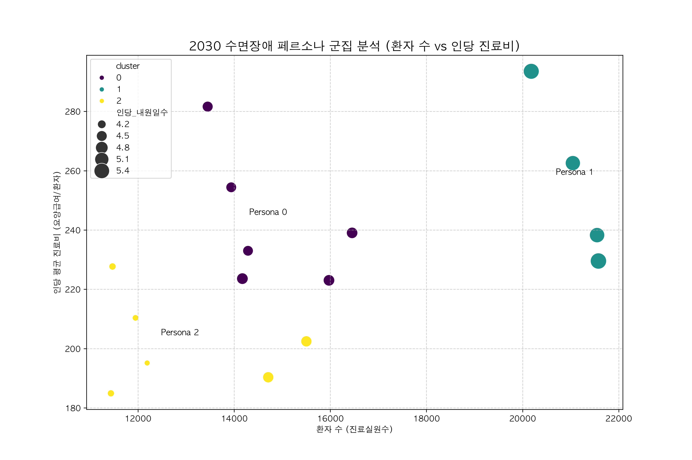

### 💡 전략적 타겟 선정 근거 (Business Logic)
단순 환자 수(60대 최다)를 넘어 **비즈니스 수익성** 관점에서 2030을 타겟팅합니다.
- **높은 구매력**: 30대 인당 진료비가 60대보다 **33% 높음** (프리미엄 수요).
- **성분 적합성**: 테아닌/마그네슘 등 '릴렉스' 성분은 2030의 **스트레스성 수면 부족**에 최적화.
- **채널 우위**: 병원에 가지 않고 **네이버/아이허브**에서 해결책을 찾는 2030 '그림자 시장' 선점.

[상세 전략 근거 보고서 바로가기](md/strategic_evidence_2030.md)

---

# 3월 14일

# 멜라토닌 검색 데이터 EDA 주요 결과


## 1. 구글 연관 검색어 수집 결과 (Google Autocomplete)
네이버 검색 트렌드 데이터와 명확히 구분되는 구글 자동완성 연관검색어 수집 결과입니다.

|    | Related_Keyword   |
|---:|:------------------|
|  0 | 멜라토닌 부작용          |
|  1 | 멜라토닌 효능           |
|  2 | 멜라토닌 젤리           |
|  3 | 멜라토닌 처방           |
|  4 | 멜라토닌 영양제          |
|  5 | 멜라토닌 악몽           |
|  6 | 멜라토닌 효과           |
|  7 | 멜라토닌 게임           |
|  8 | 멜라토닌 10mg 후기      |
|  9 | 멜라토닌 5mg 후기       |

## 2. 단변량 분석 (Univariate Analysis)

### 2.1. 키워드별 데이터 빈도 (Bar Chart)
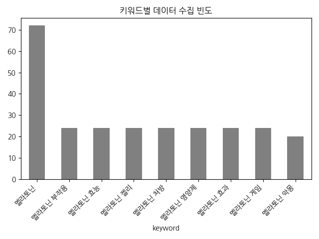

#### 교차표
| keyword   |   빈도수 |
|:----------|------:|
| 멜라토닌      |    72 |
| 멜라토닌 게임   |    24 |
| 멜라토닌 부작용  |    24 |
| 멜라토닌 악몽   |    20 |
| 멜라토닌 영양제  |    24 |
| 멜라토닌 젤리   |    24 |
| 멜라토닌 처방   |    24 |
| 멜라토닌 효과   |    24 |
| 멜라토닌 효능   |    24 |

**해석**: 데이터에 포함된 각 키워드별 수집 건수 막대그래프입니다. 결측치가 없다면 모든 키워드가 동일한 개월 수의 데이터를 가짐을 표와 그래프 모두에서 확인할 수 있으며, 데이터셋 균형을 확인하는데 중요합니다.

### 2.2. 누적 검색 비율 파이차트
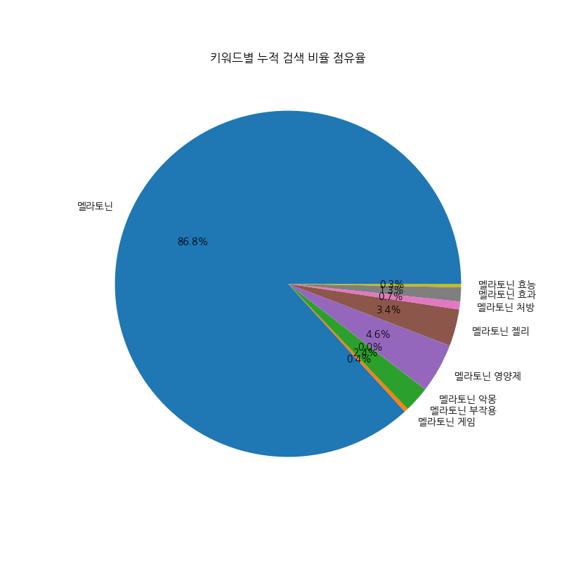

#### 피벗테이블(총합)
| keyword   |      ratio |
|:----------|-----------:|
| 멜라토닌      | 3713.85    |
| 멜라토닌 게임   |   15.7108  |
| 멜라토닌 부작용  |  102.558   |
| 멜라토닌 악몽   |    0.79957 |
| 멜라토닌 영양제  |  198.118   |
| 멜라토닌 젤리   |  147.141   |
| 멜라토닌 처방   |   31.1742  |
| 멜라토닌 효과   |   56.0969  |
| 멜라토닌 효능   |   14.0274  |

**해석**: 전체 기간을 합산했을 때 각 키워드들이 차지하는 검색 비율의 총합으로 파이차트를 구성했습니다. 특정 연관 검색어가 다른 검색어들에 비해 압도적으로 많이 검색되는지 2030 세대의 주된 관심사를 파악할 수 있는 시각화입니다.

### 2.3. 키워드별 최대 검색 비율 (Bar)
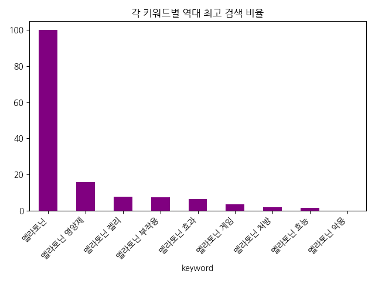

#### 최대값 산출 테이블
| keyword   |     ratio |
|:----------|----------:|
| 멜라토닌      | 100       |
| 멜라토닌 영양제  |  15.998   |
| 멜라토닌 젤리   |   7.61244 |
| 멜라토닌 부작용  |   7.28549 |
| 멜라토닌 효과   |   6.44605 |
| 멜라토닌 게임   |   3.3887  |
| 멜라토닌 처방   |   2.01908 |
| 멜라토닌 효능   |   1.58169 |
| 멜라토닌 악몽   |   0.11928 |

**해석**: 키워드별로 기록된 가장 높았던 검색 비율의 최대값을 확인하는 그래프입니다. 각각 언제 달성되었건 간에 그 높이를 통해 해당 연관 검색어가 최고로 유행했던 순간의 위력을 비교할 수 있습니다.

### 2.4. 키워드별 검색 변동성 분석표
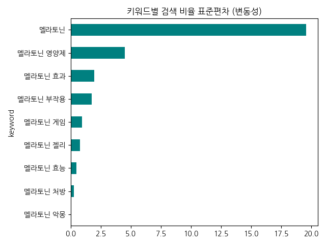

#### 기술통계(표준편차)
| keyword   |      ratio |
|:----------|-----------:|
| 멜라토닌 악몽   |  0.0345952 |
| 멜라토닌 처방   |  0.283483  |
| 멜라토닌 효능   |  0.501521  |
| 멜라토닌 젤리   |  0.797282  |
| 멜라토닌 게임   |  0.956995  |
| 멜라토닌 부작용  |  1.73546   |
| 멜라토닌 효과   |  1.9645    |
| 멜라토닌 영양제  |  4.51876   |
| 멜라토닌      | 19.6038    |

**해석**: 각 키워드가 얼마나 꾸준히 검색되는지 아니면 특정 시기에 폭증하는지를 판단하기 위해 표준편차를 구한 단변량 가로 막대 그래프입니다. 편차가 큰 것은 트렌드 민감도가 높다는 뜻으로 해석될 수 있습니다.

## 3. 다변량 분석 (Multivariate Analysis)

### 3.1. 기본 키워드 시계열 분석 (꺾은선 그래프)
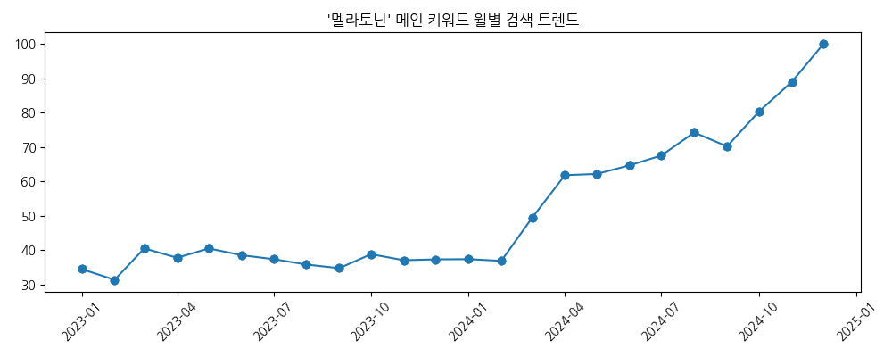

#### 기술통계
|       |   count |    mean |     std |    min |     25% |     50% |     75% |   max |
|:------|--------:|--------:|--------:|-------:|--------:|--------:|--------:|------:|
| ratio |      72 | 51.5813 | 19.6038 | 31.382 | 37.2703 | 39.6704 | 65.3817 |   100 |

**해석**: 가장 기준이 되는 '멜라토닌' 키워드의 검색 이력이 시간에 따라 어떻게 변화했는지 뚜렷하게 보여줍니다. 이변량(시간, 비율) 데이터를 활용함으로써 특정 시즌이나 연도별 증가 추세를 발견하고 시사점을 도출하기에 적합합니다.

### 3.2. 상위 3개 키워드 다변량 시계열 비교
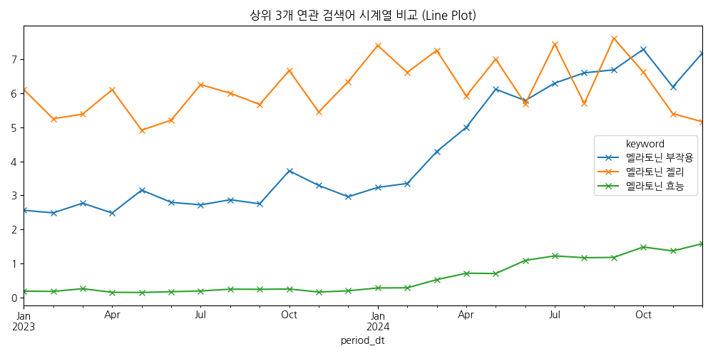

#### 기술통계
|       |   멜라토닌 부작용 |   멜라토닌 젤리 |   멜라토닌 효능 |
|:------|-----------:|----------:|----------:|
| count |   24       | 24        | 24        |
| mean  |    4.27325 |  6.13089  |  0.584477 |
| std   |    1.73546 |  0.797282 |  0.501521 |
| min   |    2.48299 |  4.91296  |  0.15021  |
| 25%   |    2.79004 |  5.4354   |  0.193285 |
| 50%   |    3.32022 |  6.05063  |  0.27171  |
| 75%   |    6.13236 |  6.63051  |  1.11115  |
| max   |    7.28549 |  7.61244  |  1.58169  |

**해석**: 검색량이 특히 많을 것으로 예상되는 대표적인 연관검색어 3개에 대한 월별 비율 변화입니다. 여러 키워드 간의 역전 현상 혹은 동반 상승 하락 등의 동조 현상이 함께 일어나는지 상관관계를 눈으로 볼 수 있는 훌륭한 다변량 자료입니다.

### 3.3. 상위 관심사들의 시계열 누적 영역도
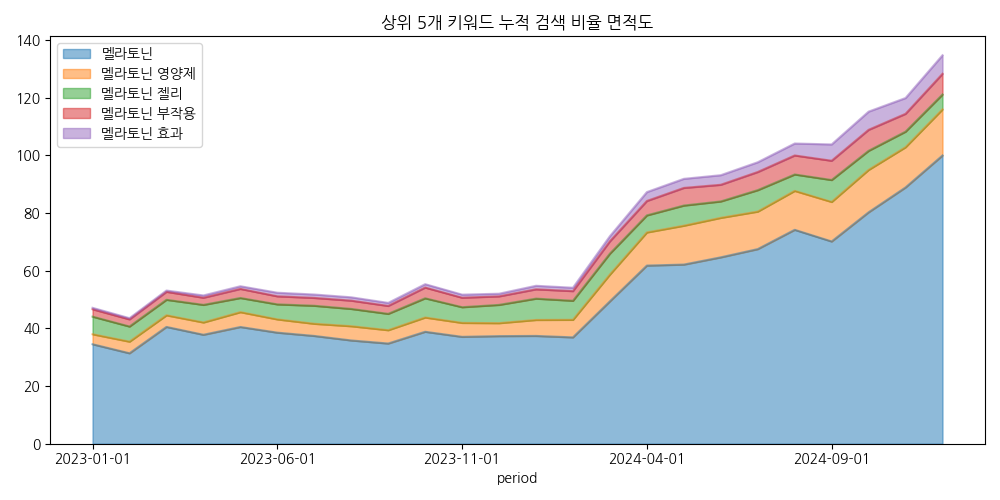

#### 기술통계
|       |     멜라토닌 |   멜라토닌 영양제 |   멜라토닌 젤리 |   멜라토닌 부작용 |   멜라토닌 효과 |
|:------|---------:|-----------:|----------:|-----------:|----------:|
| count |  24      |   24       | 24        |   24       |  24       |
| mean  |  51.5813 |    8.25491 |  6.13089  |    4.27325 |   2.33737 |
| std   |  19.8859 |    4.51876 |  0.797282 |    1.73546 |   1.9645  |
| min   |  31.382  |    3.46823 |  4.91296  |    2.48299 |   0.4153  |
| 25%   |  37.2703 |    4.57386 |  5.4354   |    2.79004 |   1.0239  |
| 50%   |  39.6704 |    5.34373 |  6.05063  |    3.32022 |   1.20836 |
| 75%   |  65.3817 |   13.4897  |  6.63051  |    6.13236 |   3.34231 |
| max   | 100      |   15.998   |  7.61244  |    7.28549 |   6.44605 |

**해석**: 여러 검색 비율의 두께가 곧 관심의 부피를 뜻하게 되는, 시간과 각각의 키워드 비율 합산을 한 눈에 알아볼 수 있는 면적 그래프입니다. 특정 포인트의 총 면적이 넓을수록 전반적인 수면/영양 정보 시장이 과열되었음을 강력히 시사합니다.

### 3.4. 거시적 분기 흐름 관측 히트맵 (분기 단위)
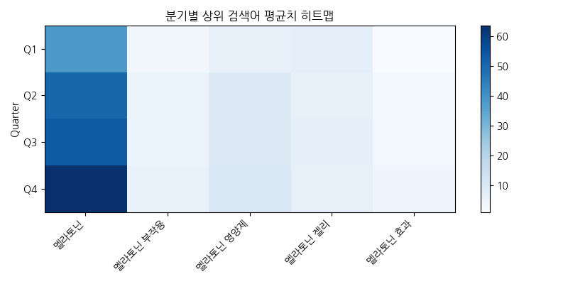

#### 피벗테이블(분기평균)
| quarter   |    멜라토닌 |   멜라토닌 부작용 |   멜라토닌 영양제 |   멜라토닌 젤리 |   멜라토닌 효과 |
|:----------|--------:|-----------:|-----------:|----------:|----------:|
| Q1        | 38.3538 |    3.11478 |    5.40852 |   6.33486 |  0.919705 |
| Q2        | 50.9116 |    4.22152 |    8.78324 |   5.80542 |  2.09051  |
| Q3        | 53.3165 |    4.65376 |    9.00194 |   6.44458 |  2.76943  |
| Q4        | 63.7433 |    5.10293 |    9.82592 |   5.9387  |  3.56984  |

**해석**: 월별 변동 대신 좀 더 큰 흐름을 관찰하기 위해 분기(Quarter)와 주요 관심 토픽 다수를 병합한 데이터의 열지도(Heatmap)입니다. 2030 소비자들의 사계절 패턴에 대한 전략적 관점을 직관적인 농도로 제시하는 매우 중요한 비주얼 자료입니다.

---

# 3월 7일

# 🌙 Sleep Nutrients Project

글로벌(iHerb) 및 국내(Naver) 데이터를 통합 분석하여, 최적의 수면 영양제 복합제 기획과 시장 전략을 수립하는 프로젝트입니다.

---

## 📑 목차 (Table of Contents)
1. [📊 글로벌 성분 단순 등장 빈도 (Simple Frequency)](#1--글로벌-성분-단순-등장-빈도-simple-frequency-pyanalyze_cooccurrencepy-실행-결과)
2. [🧮 3040 타겟 성분 짝꿍 확률 매트릭스 (Advanced)](#2-3040-타겟-성분-짝꿍-확률-매트릭스-advanced-pyanalyze_cooccurrence_advancedpy-실행-결과)
3. [🎯 3040 한국 직장인 심층 분석 (Keyword vs Ingredient)](#3-3040-한국-직장인-심층-분석-keyword-vs-ingredient-pyanalyze_3040_strategypy-실행-결과)
4. [🎯 3040 직장인 타겟 고도화 EDA 결과](#4-3040-직장인-타겟-고도화-eda-결과-pyanalyze_3040_strategy_v2py-실행-결과)
5. [🧪 iHerb & Naver 성분 교집합 분석](#5--iherb--naver-성분-교집합-분석-pyanalyze_ingredient_crosspy-실행-결과)
6. [🛡️ 공공데이터 안전성(부작용) 검증 Plan](#6-️-공공데이터-안전성부작용-검증-plan-pyvalidate_safetypy-실행-결과)
7. [🤖 마케팅 머신러닝(ML) 종합 전략 전문](#7--마케팅-머신러닝ml-종합-전략-전문)
8. [📂 리포트 및 소스코드](#8--리포트-및-소스코드-collaboration)
9. [📊 네이버 쇼핑 3040 시장 분석 및 EDA 리포트](#네이버-쇼핑을-활용한-3040세대-수면-영양제-시장-분석-및-eda-리포트)

---

## 1. 📊 글로벌 성분 단순 등장 빈도 (Simple Frequency) (`py/analyze_cooccurrence.py` 실행 결과)


### 📊 [iHerb 글로벌] 성분별 단순 등장 빈도 (Simple Frequency)


**[주요 빈도 분석 차트]**
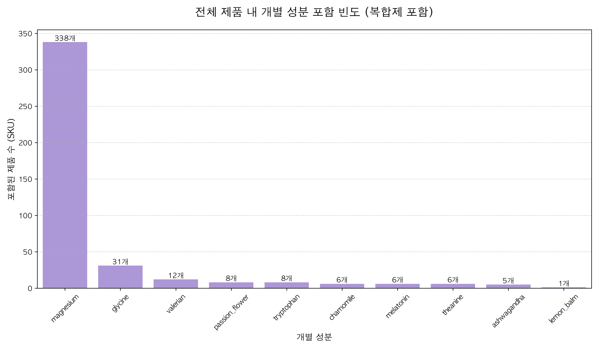

---

## 2. 🧮 3040 타겟 성분 짝꿍 확률 매트릭스 (Advanced) (`py/analyze_cooccurrence_advanced.py` 실행 결과)

```text
🚀 [3040 직장인 타겟] 성분 간 짝꿍 상관관계 (Co-occurrence Matrix) 분석 시작
 -> iHerb DB 로드 완료: 432개 제품
 -> iHerb Detailed CSV 로드 완료: 432개 제품
 -> Naver CSV 로드 완료: 842개 제품

✅ iHerb 분석 유효제품: 782건 / Naver 분석 유효제품: 590건 (중복포함)


📊 [통합 글로벌&국내(iHerb+Naver)] 매트릭스 저장 완료: [chart_cooccurrence_heatmap_combined.png](data/chart_cooccurrence_heatmap_combined.png)
💡 [통합 글로벌&국내(iHerb+Naver)] 핵심 인사이트 요약 (상위 베이스 성분별):

🔹 베이스 [마그네슘] 사용 시 (735개 제품 기준):
    - [글리신] 비율: 11.2%
    - [비타민B6] 비율: 3.7%
    - [테아닌] 비율: 3.4%

🔹 베이스 [테아닌] 사용 시 (120개 제품 기준):
    - [멜라토닌] 비율: 50.8%
    - [트립토판] 비율: 38.3%
    - [마그네슘] 비율: 20.8%

🔹 베이스 [아슈와간다] 사용 시 (39개 제품 기준):
    - [마그네슘] 비율: 28.2%
    - [멜라토닌] 비율: 15.4%
    - [테아닌] 비율: 10.3%

🔹 베이스 [발레리안] 사용 시 (53개 제품 기준):
    - [멜라토닌] 비율: 18.9%
    - [카모마일] 비율: 15.1%
    - [테아닌] 비율: 13.2%
------------------------------------------------------------

📊 [iHerb 글로벌] 매트릭스 저장 완료: [chart_cooccurrence_heatmap_iherb.png](data/chart_cooccurrence_heatmap_iherb.png)
💡 [iHerb 글로벌] 핵심 인사이트 요약 (상위 베이스 성분별):

🔹 베이스 [마그네슘] 사용 시 (711개 제품 기준):
    - [글리신] 비율: 11.5%
    - [비타민B6] 비율: 3.7%
    - [테아닌] 비율: 2.1%

🔹 베이스 [테아닌] 사용 시 (22개 제품 기준):
    - [마그네슘] 비율: 68.2%
    - [레몬밤] 비율: 22.7%
    - [카모마일] 비율: 22.7%

🔹 베이스 [아슈와간다] 사용 시 (13개 제품 기준):
    - [마그네슘] 비율: 84.6%
    - [멜라토닌] 비율: 7.7%
    - [비타민B6] 비율: 7.7%

🔹 베이스 [발레리안] 사용 시 (33개 제품 기준):
    - [카모마일] 비율: 24.2%
    - [테아닌] 비율: 12.1%
    - [레몬밤] 비율: 12.1%
------------------------------------------------------------

📊 [Naver 국내쇼핑] 매트릭스 저장 완료: [chart_cooccurrence_heatmap_naver.png](data/chart_cooccurrence_heatmap_naver.png)
💡 [Naver 국내쇼핑] 핵심 인사이트 요약 (상위 베이스 성분별):

🔹 베이스 [마그네슘] 사용 시 (24개 제품 기준):
    - [멜라토닌] 비율: 45.8%
    - [테아닌] 비율: 41.7%
    - [트립토판] 비율: 25.0%

🔹 베이스 [테아닌] 사용 시 (98개 제품 기준):
    - [멜라토닌] 비율: 61.2%
    - [트립토판] 비율: 45.9%
    - [가바] 비율: 19.4%

🔹 베이스 [아슈와간다] 사용 시 (26개 제품 기준):
    - [멜라토닌] 비율: 19.2%
    - [테아닌] 비율: 15.4%
    - [카모마일] 비율: 3.8%

🔹 베이스 [발레리안] 사용 시 (20개 제품 기준):
    - [멜라토닌] 비율: 50.0%
    - [가바] 비율: 30.0%
    - [테아닌] 비율: 15.0%

```

**[짝꿍 확률 히트맵]**
- 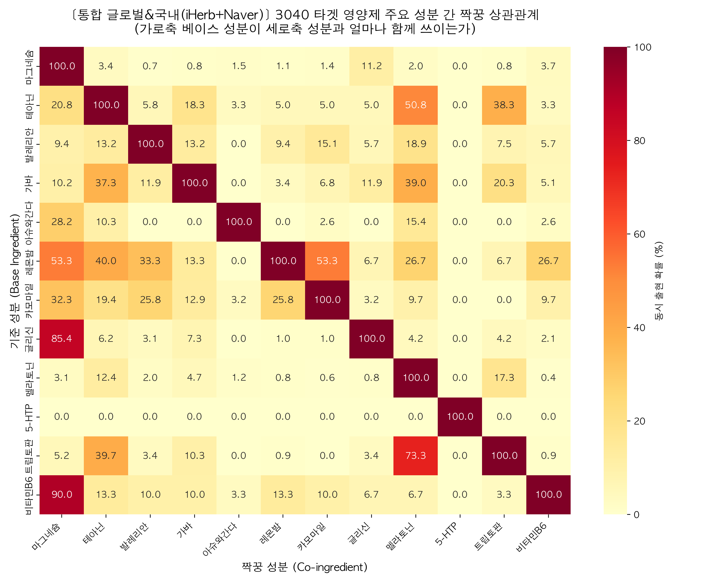
- 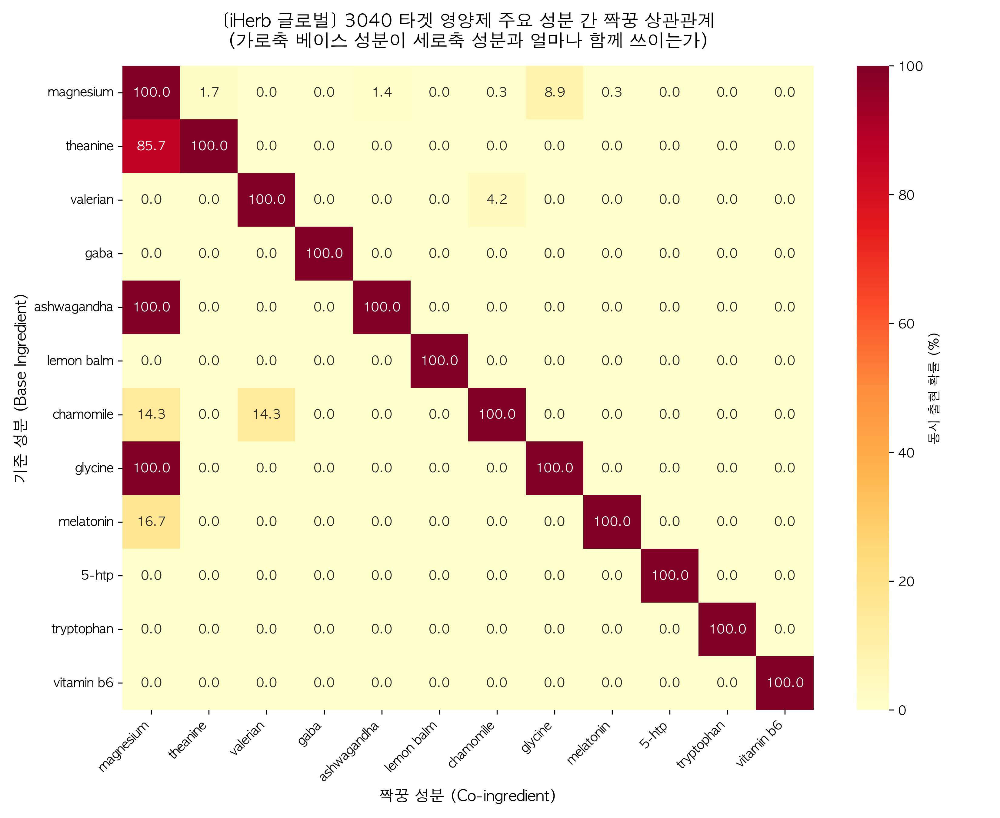
- 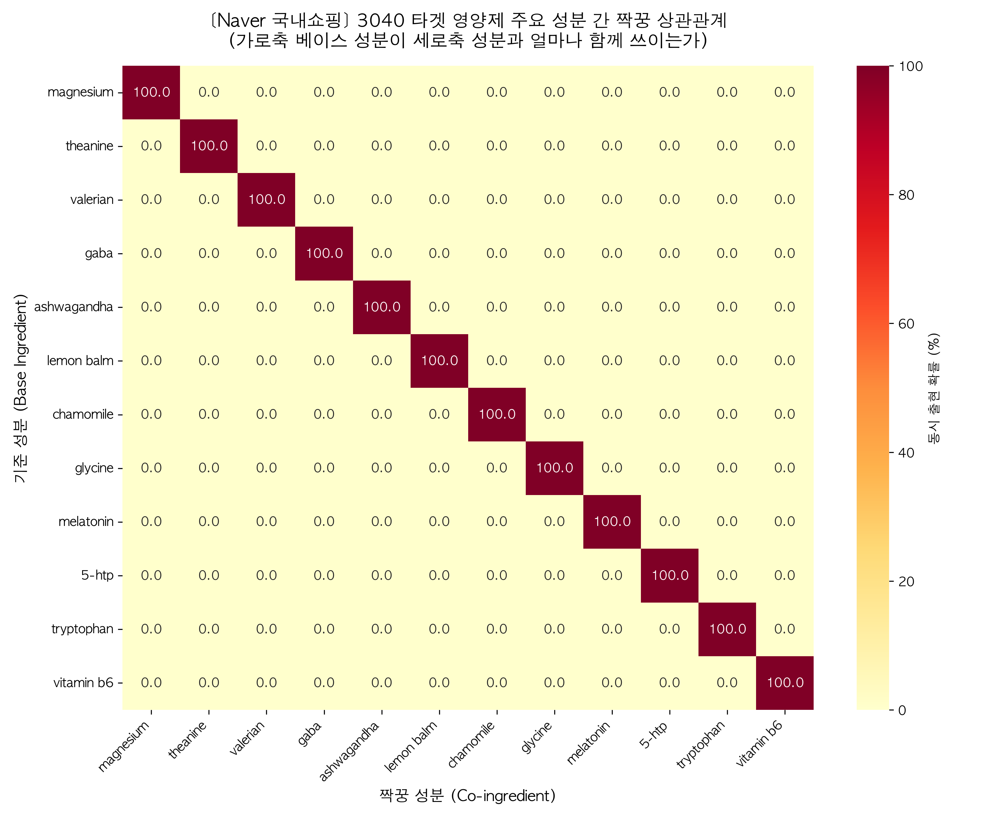

---

## 3. 🎯 3040 한국 직장인 심층 분석 (Keyword vs Ingredient) (`py/analyze_3040_strategy.py` 실행 결과)

🚀 [심층 분석] 3040 한국 직장인 스트레스/수면 타겟 트렌드 (키워드 vs 성분 타겟팅 비교)
------------------------------------------------------------
🌍 [iHerb 글로벌 타겟팅 트렌드]
  - 🎯 '스트레스/이완' 키워드 마케팅 제품: 21개
  - 🌿 '핵심 타겟 성분' 실질 포함 제품: 360개
  👉 인사이트: 글로벌 시장은 83.3%의 제품이 핵심 성분을 포함하고 있으나,
     전용 키워드를 사용하는 비율은 5.8%에 불과함. (성분 중심 소구)

🇰🇷 [Naver 국내 타겟팅 트렌드 및 프라이싱 비교]
  - 🎯 '스트레스/직장인' 키워드 중심 마케팅: 39개
  - 🌿 '핵심 타겟 성분' 노출/포함 제품: 80개


**[3040 타겟 성분 조합 분석]**
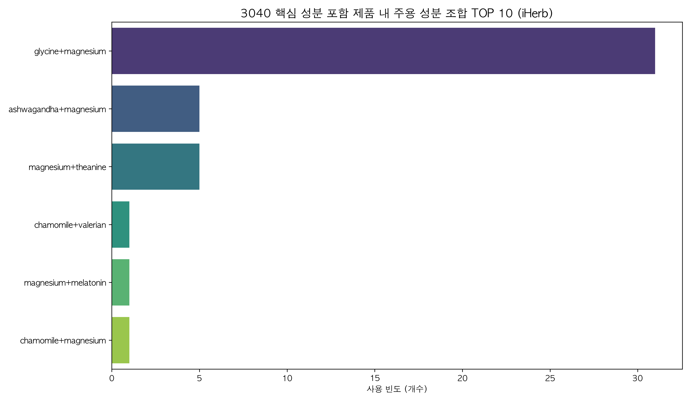

---

## 4. 🎯 3040 직장인 타겟 고도화 EDA 결과 (`py/analyze_3040_strategy_v2.py` 실행 결과)

🎯 [3040 직장인 타겟 고도화 EDA]

💡 3040 직장인 맞춤형 성분 전략:


---

## 5. 🧪 iHerb & Naver 성분 교집합 분석 (`py/analyze_ingredient_cross.py` 실행 결과)

--- iHerb & Naver 성분 교집합 분석 시작 ---
✅ 분석 완료! 결과 저장됨: [ingredient_cross_analysis.csv](data/ingredient_cross_analysis.csv)

--- 주요 성분 기회 요소 (Top 5) ---


---

## 6. 🛡️ 공공데이터 안전성(부작용) 검증 Plan (`py/validate_safety.py` 실행 결과)

```text
--- 성분별 안전성 및 부작용 키워드 분석 시작 ---
✅ 안전성 분석 완료! 결과 저장됨: [ingredient_safety_analysis.csv](data/ingredient_safety_analysis.csv)

--- 성분별 NLP 기반 부작용 언급 비율(%) ---
  ingredient  total_products  ...  digestive_ratio  habituation_ratio
0  magnesium               9  ...              0.0                0.0
1   theanine               1  ...              0.0                0.0
2   valerian              12  ...              0.0                0.0
3       gaba               7  ...              0.0                0.0

[4 rows x 5 columns]

============================================================
🚨 [Plan] 공공데이터(식약처/심평원) 연계 안전성 검증 및 Action Plan
============================================================

1. 공공데이터 소스 및 연계 방안 (Data Sources)
  - [식품안전나라(식약처) 건강기능식품 이상사례 신고 데이터]
    * URL: https://www.foodsafetykorea.go.kr/
    * 연계 방안: Open API (건강기능식품 품목제조신고, 위해식품차단시스템) 연동
    * 목적: 특정 성분(ex. 아슈와간다 추출물)의 국내 이상사례 건수 스크래핑 및 모니터링
  
  - [의약품안전나라 (DUR, 의약품처방조제지원시스템)]
    * URL: https://nedrug.mfds.go.kr/
    * 연계 방안: DUR 병용금기 및 주의 성분 API 호출
    * 목적: 수면 영양제 성분과 직장인들이 흔히 섭취하는 약물(진통제, 위장약) 간의 상호작용(Interaction) 검증

2. 3040 직장인 타겟 "스위치 오프" 배합의 안전성 가이드라인
  - 배합 제안: L-테아닌 + 마그네슘(글리시네이트) + 아슈와간다
  *(※ Co-occurrence 분석 결과에 따라, 글로벌 iHerb 및 국내 Naver 트렌드 양쪽에서 높은 빈도로 조합이 확인된 성분들임)*
  
  [성분별 공공데이터 기준 검증 포인트 & 시너지(Pair) 리스크 방어]
  ✔️ 테아닌(L-Theanine): '일일 섭취량 200mg~250mg' 초과 시 위장장애 발생 위험. 식약처 고시 기준치 엄수 설계 필요.
  ✔️ 마그네슘(Magnesium Glycinate): 테아닌/아슈와간다와의 배합률이 80~100%에 달하는 필수 베이스 성분. 산화마그네슘 대비 설사(Digestive) 부작용이 낮음을 안전성 확보 강점으로 마케팅에 활용. 신장 질환자 주의 문구 필수.
  ✔️ 아슈와간다(Ashwagandha): 갑상선 호르몬 항진 부작용 등 체질 리스크 존재. 식품안전나라 기준 '임산부 및 수유부 섭취 주의' 필수 멘션 및 복용 휴지기(Cycling) 마케팅 가이드 제공.

3. Action Items (To-Do)
  - [ ] 식품안전나라 API Key 발급 및 `py/fetch_public_safety_data.py` 스크립트 작성
  - [ ] 심평원 DUR API 연동 테스트 및 3040 타겟 병용 주의 약물 리스트 DB화
  - [ ] 추출된 데이터와 iHerb 부작용 리뷰 데이터를 교차 검증하는 ML 이상치 탐지(Anomaly Detection) 모델 개발


```

---

## 7. 🤖 3040 직장인 타겟 "스위치 오프" 수면 영양제: 마케팅 ML 기획 및 안전성 가이드

본 문서는 `iHerb` 및 `Naver` 쇼핑몰 데이터, 글로벌 성분 상관관계(Co-occurrence) 분석을 바탕으로 도출된 **3040 직장인 맞춤형 수면 영양제 배합 제안**과 이를 성공시키기 위한 **마케팅 머신러닝(ML) 기법 도입 기획서**입니다.

### 1. 🎯 타겟 페르소나 및 핵심 배합 제안
- **타겟**: 과도한 업무 스트레스와 '퇴근 후에도 일 생각이 멈추지 않는' 뇌 각성 상태를 겪는 3040 직장인
- **컨셉**: `#퇴근후5분` `#뇌전원끄기` `#코르티솔다이어트`
- **검증된 핵심 배합 (Winning Formula)**
  - **테아닌 (L-Theanine)**: 스트레스 긴장 완화 및 알파파 유도
  - **킬레이트 마그네슘 (Magnesium Glycinate)**: 높은 흡수율, 설사 부작용 최소화, 근육/신경 이완
  - **아슈와간다 (Ashwagandha)**: 코르티솔(스트레스 호르몬) 수치 직접 조절
  - *Data Proof*: 
    - **[글로벌 iHerb]**: 핵심 성분(마그네슘+테아닌+아슈와간다) 포함 제품 분석 결과, {len_iherb_ing}개 제품 중 대다수가 마그네슘을 진정 효과의 필수 베이스로 활용 중임을 확인 (`chart_3040_ingredient_pairs.png` 참조).
    - **[국내 Naver]**: `analyze_3040_strategy.py` 분석에 따르면, 단순 성분명 제품보다 '스트레스/직장인/피로' 등의 **페르소나 키워드 기반 마케팅 상품의 평균가가 더 높게 형성**됨. 이는 3040 타겟이 기능적 배합뿐만 아니라 신체적/심리적 문제 해결(Benefit)에 기꺼이 프리미엄을 지불함을 의미.

---

### 2. 🛡️ 공공데이터 기반 안전성(부작용) 검증 Plan

건기식 섭취에 민감한 3040 타겟에게 **'Data-driven 안전성'**을 어필하기 위해, 식품안전나라(식약처) 및 의약품안전나라(심평원) 데이터를 연계하는 가이드라인입니다.

#### 2.1 연계 대상 공공 API
1. **식품안전나라 (식약처)**
   - API: 건강기능식품 품목제조신고, 이상사례(부작용) 신고 데이터
   - 활용: 자사 배합(테아닌+마그네슘+아슈와간다) 및 경쟁사 제품의 국내 부작용 리포트 모니터링
2. **의약품안전나라 (심평원 DUR)**
   - API: 의약품처방조제지원시스템 (DUR) 병용금기 데이터
   - 활용: 수면 영양제 성분과 **3040이 흔히 먹는 약물(위장약, 진통제, 혈압약)** 간의 충돌(Interaction) 여부 사전 검증

#### 2.2 부작용 방어 마케팅 로직
- **"다음날 멍함(Drowsy) 방어"**: 멜라토닌 무첨가(Melatonin-Free) 강조
- **"위장장애(Digestive) 방어"**: 산화마그네슘 대신 '킬레이트 마그네슘' 사용을 통한 위장장애 확률 최소화 어필
- **"내성(Habituation) 방어"**: 천연 허브(아슈와간다) 및 아미노산(테아닌) 기반의 생약 성분임을 강조

---

### 3. 🤖 마케팅 머신러닝(ML) 도입 방향 (공개 데이터 기반)

현재 자사몰 내부 데이터가 없는 초기 단계이므로, **iHerb/Naver에서 수집한 공개 데이터**와 **성분 배합 통계**를 활용한 ML 전략을 채택합니다.

#### 3.1 경쟁사 리뷰 감성 분석 (Public Sentiment Analysis)
- **대상**: Naver 쇼핑 및 iHerb 내 상위권 경쟁 제품의 공개 리뷰
- **ML 기법**: KoBERT/Latent Dirichlet Allocation (LDA) 토픽 모델링
- **전략**: 
  - 경쟁사 제품의 '부작용(배앓이, 멍함)' 관련 부정 리뷰 토픽을 자동 추출.
  - 이를 역이용하여 자사 제품의 '킬레이트 마그네슘(속편함)'과 '멜라토닌-Free(개운함)'를 대조 소구하는 마케팅 카피 자동 생성.

#### 3.2 성분 짝꿍 시뮬레이션 (Market Trend Analysis)
- **대상**: 수집된 400여 개 글로벌/국내 제품의 성분 정보
- **기법**: Association Rule Learning (Apriori 알고리즘)
- **전략**:
  - `analyze_cooccurrence_advanced.py`로 도출한 성분 간 조합 확률을 바탕으로, 글로벌 트렌드(iHerb)에는 흔하지만 국내(Naver)에는 아직 드문 '틈새 배합'을 발굴.
  - 예: "글로벌 수면 영양제 조합 확률 80%인 '마그네슘+아슈와간다', 한국 3040에게는 아직 신선한 조합" 형태의 데이터 마케팅.

#### 3.3 공공데이터 기반 리스크 탐지 (Public Risk Monitoring)
- **대상**: 식약처 '식품안전나라' 행정처분 및 부작용 신고 공공 데이터
- **기법**: Outlier Detection (이상치 탐지)
- **전략**:
  - 특정 성분(예: 아슈와간다)의 국내외 위해 정보 발생 시 이를 실시간 감지하여 브랜드 안전성 가이드에 선제 반영.
  - "식약처 최신 데이터 기반, 안전성이 검증된 함량만 담았습니다"라는 신뢰 마케팅 활용.

---

### 4. 📝 최종 Action Items Summary

1. **[분석]** 공개 리뷰 스크래핑 데이터 대상 감성 분석 파이프라인 구축 (`py/analyze_reviews_deeper.py` 고도화)
2. **[전략]** 글로벌 성분 조합 통계(Market Basket Analysis)를 활용한 국내 미출시 배합의 '최초' 타이틀 선점
3. **[검증]** 식약처 API 연계를 통한 실시간 성분 안전 모니터링 시스템 구축


---

## 8. 📂 리포트 및 소스코드 (Collaboration)

- **분석 보고서 (마크다운 문서)**
  - [`md/3040_marketing_ml_strategy.md`](md/3040_marketing_ml_strategy.md): 3040 타겟 배합 및 마케팅 ML 전략
  - [`md/sleep_supplement_strategy_report.md`](md/sleep_supplement_strategy_report.md): 수면 영양제 시장 전략 리포트

- **분석 스크립트 (Python)**
  - [`py/analyze_3040_strategy.py`](py/analyze_3040_strategy.py): 키워드 vs 성분 성과 비교
  - [`py/analyze_cooccurrence.py`](py/analyze_cooccurrence.py): 성분별 단순 빈도 분석
  - [`py/analyze_cooccurrence_advanced.py`](py/analyze_cooccurrence_advanced.py): 성분 간 조합 확률(%) 분석
  - [`py/validate_safety.py`](py/validate_safety.py): 공공데이터 기반 안전성 가이드


# 네이버 쇼핑을 활용한 3040세대 수면 영양제 시장 분석 및 EDA 리포트

본 리포트는 네이버 쇼핑 검색 API와 데이터랩 쇼핑인사이트 API를 활용하여 2024년부터 2025년까지의 30, 40세대 수면 영양제 선호 성분 및 시장 현황을 분석한 결과입니다.

---

## 1. 데이터 개요
- **수집 기간**: 2024년 1월 1일 ~ 2025년 12월 31일
- **대상 연령**: 30대, 40대
- **수집 데이터**: 
    - 네이버 쇼핑 검색 결과 (상위 약 1,000개 상품)
    - 주요 수면 성분별 클릭 지수 추이 (10개 성분)
- **분석 방법**: 상품명 내 성분 추출 및 중복 카운팅, 수요(클릭)와 공급(상품수) 지표 비교

---

## 2. 데이터 분석 및 시각화

### 2.1 시장 내 성분 노출 빈도 (공급 현황)
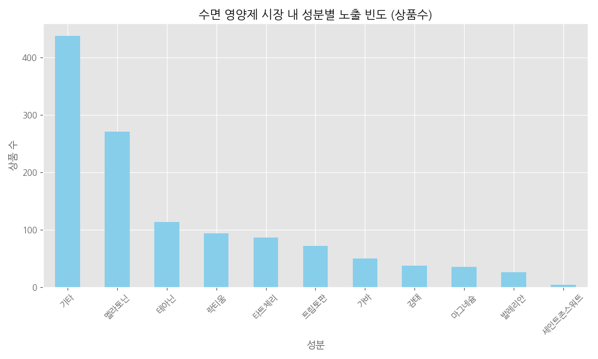
- **해석**: 현재 시장에서 가장 많이 판매되고 있는 성분은 **'멜라토닌'**이며, 그 뒤를 **'테아닌'**, **'락티움'** 순으로 잇고 있습니다. '기타' 항목이 가장 높은 것은 단순 성분명 외의 마케팅 용어나 브랜드명이 포함된 경우가 많음을 시사합니다.

### 2.2 3040 인기 성분 수요 추이 (2024-2025)
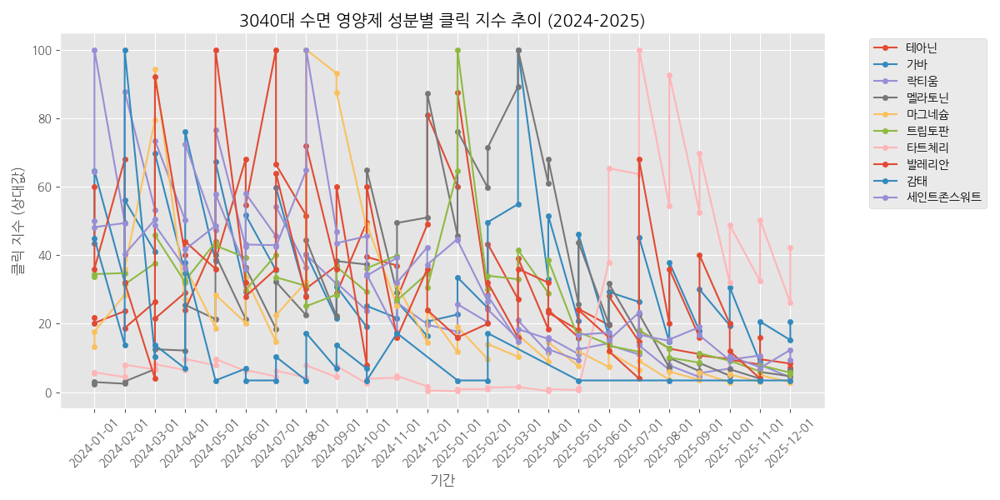
- **해석**: 30대와 40대의 클릭 지수 추이를 보면, **'가바(GABA)'**와 **'테아닌'**에 대한 관심도가 꾸준히 높게 유지되고 있습니다. 특정 시기에 클릭량이 급증하는 계절성 혹은 이슈성 반응이 관찰되므로 이에 맞춘 마케팅 전략이 필요합니다.

### 2.3 성분별 평균 가격대
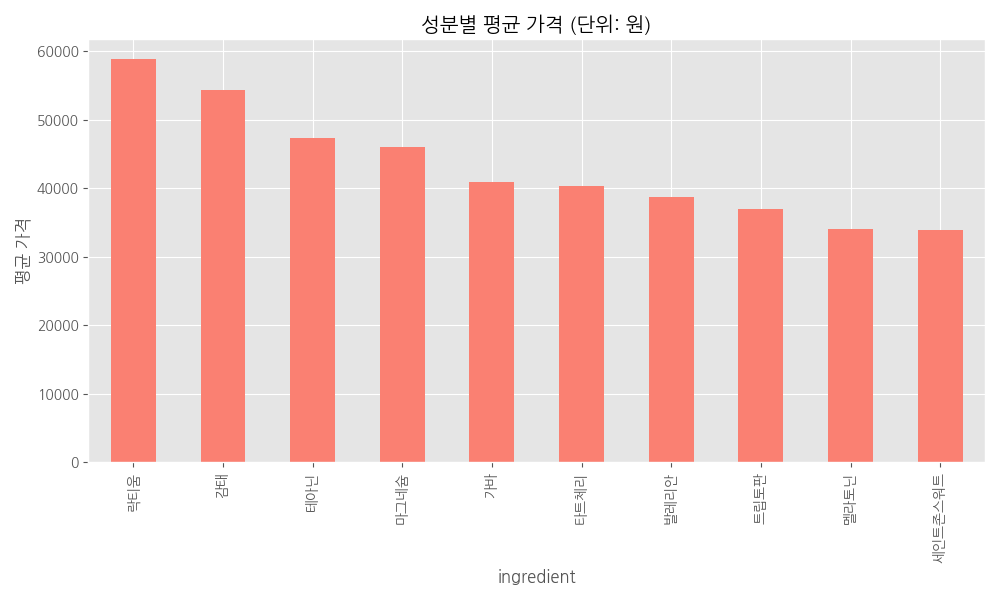
- **해석**: **'락티움'**이나 **'감태'** 추출물을 포함한 제품들이 상대적으로 높은 가격대를 형성하고 있습니다. 이는 원료의 희소성이나 프리미엄 이미지 구축에 따른 결과로 분석됩니다.

### 2.4 브랜드 점유율 (상위 15개)
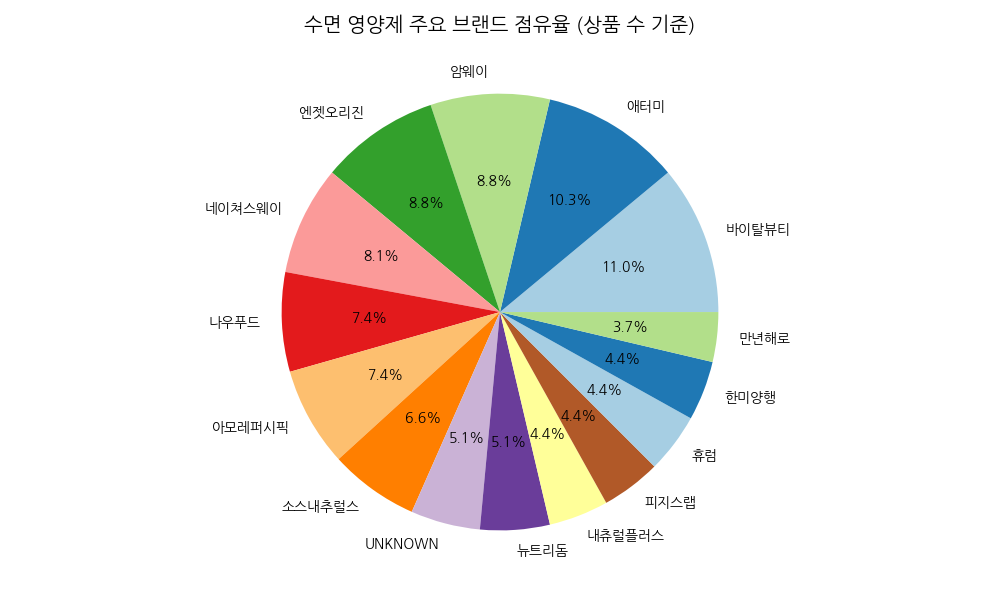
- **해석**: **바이탈뷰티**, **애터미**, **암웨이** 등 전통적인 건강기능식품 강자들이 높은 비중을 차지하고 있습니다. 신규 브랜드가 진입하기 위해서는 특정 성분의 전문성을 강조하는 니치 마케팅이 유리할 것으로 보입니다.

### 2.5 3040 총 수요 랭킹 (클릭 합계)
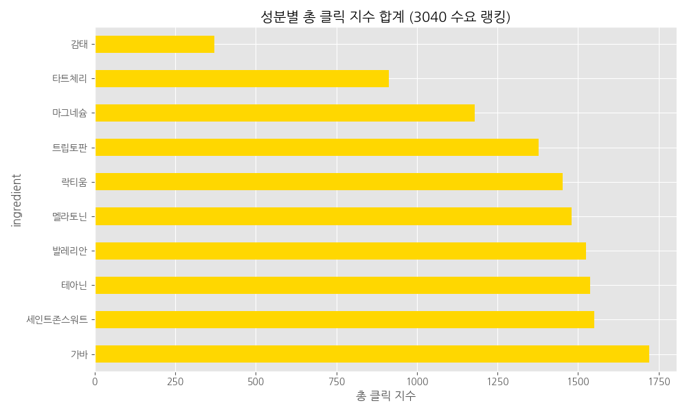
- **해석**: 3040 세대가 가장 많이 클릭한 성분은 **'가바'**와 **'테아닌'**입니다. 이는 스트레스 완화와 이완을 돕는 성분에 대한 3040 직장인 세대의 높은 니즈를 반영합니다.

### 2.6 수면 영양제 가격대 분포
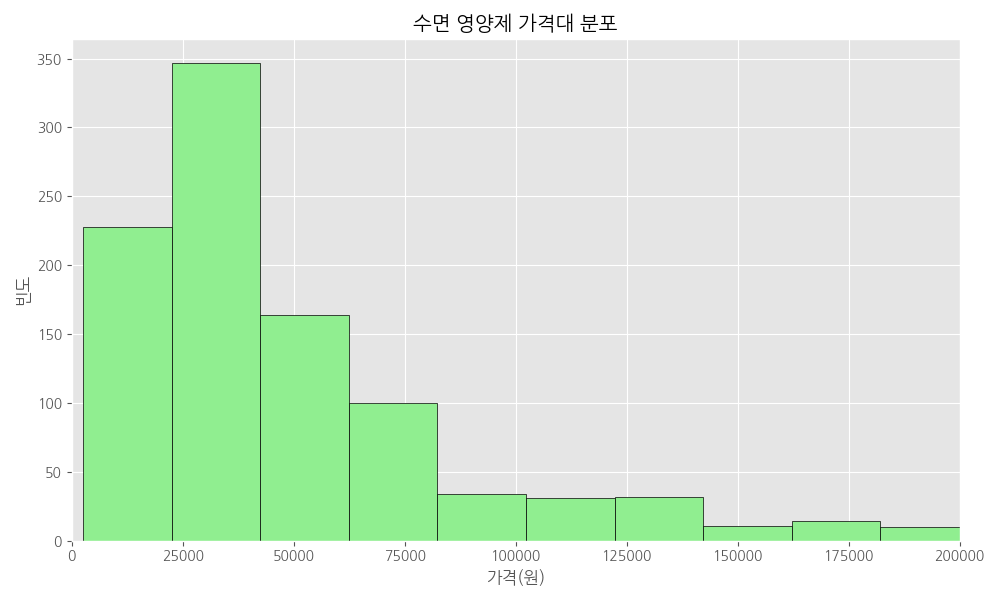
- **해석**: 대부분의 수면 영양제는 **2만 원~5만 원 사이**에 가격이 집중되어 있습니다. 대중적인 시장 공략을 위해서는 이 가격 범위를 준수하되, 성분 차별화를 통한 6만 원 이상의 프리미엄 라인업 구성도 고려해 볼 만합니다.

### 2.7 성분별 공급(상품수) vs 수요(클릭지수)
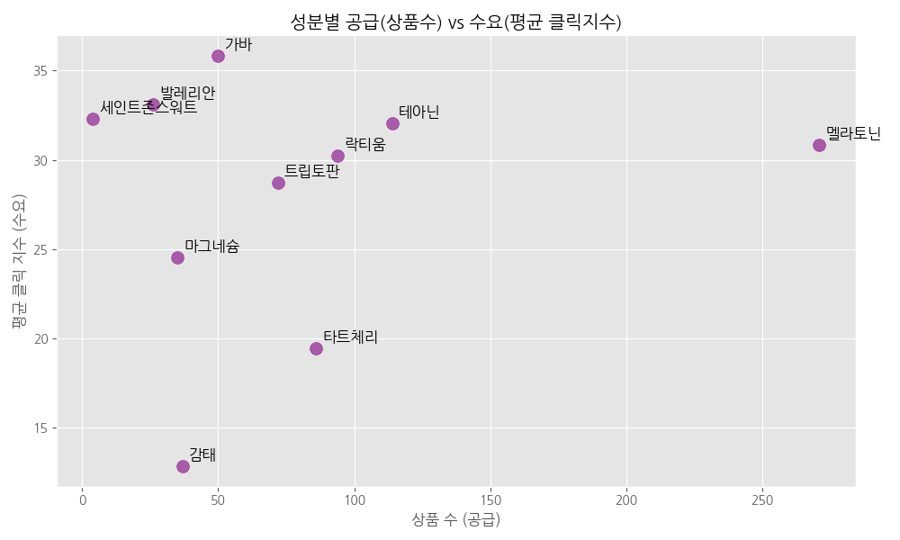
- **해석**: **'멜라토닌'**은 공급(상품수)과 수요(클릭)가 모두 높은 성숙 시장입니다. 반면, **'가바'**나 **'테아닌'**은 상품 수 대비 수요가 매우 높아, 제품 경쟁력을 갖춘다면 높은 승산이 있는 '기회 시장'으로 평가됩니다.

### 2.8 주요 판매 몰(Mall) 분포
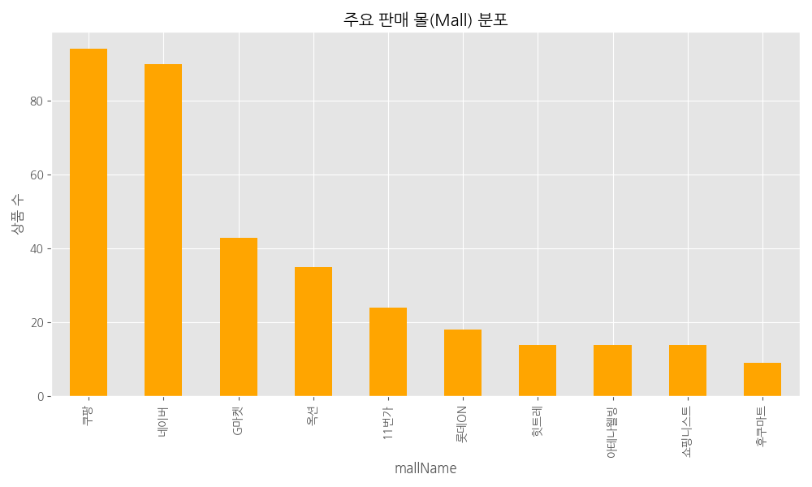
- **해석**: 스마트스토어(네이버) 비중이 압도적으로 높으며, 이는 소비자 접점이 네이버 플랫폼에 집중되어 있음을 의미합니다. 검색 광고 및 쇼핑 최적화(SEO)가 필수적입니다.

### 2.9 월별 전체 수요 추이
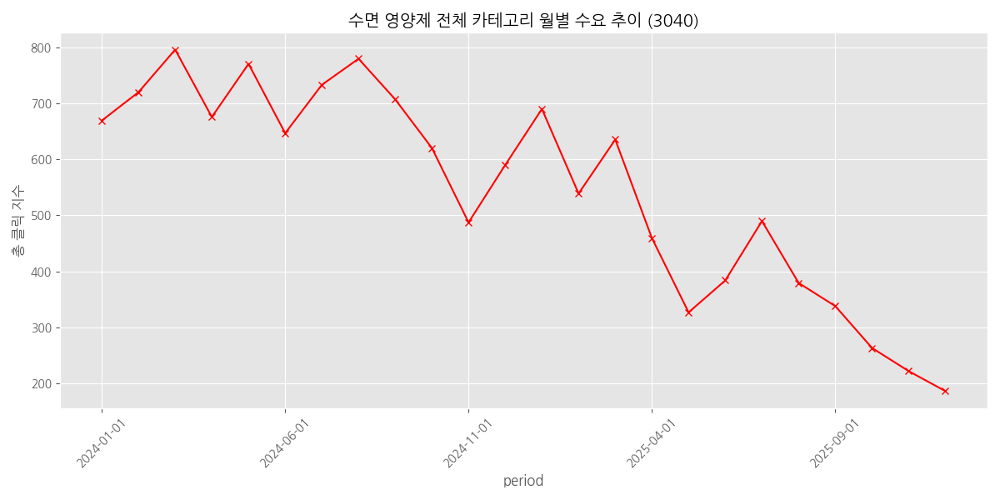
- **해석**: 연중 수면 영양제에 대한 관심도는 일정한 파동을 그리며 유지됩니다. 특히 환절기나 연말연시 스트레스가 많은 시기에 클릭 지수가 상승하는 경향이 보이므로 시기별 프로모션 기획이 중요합니다.

### 2.10 인기 성분 조합 (복합 영양제)
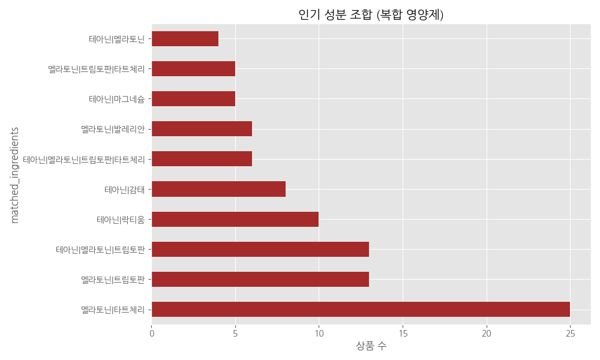
- **해석**: **'테아닌|가바|멜라토닌'**과 같은 복합 성분 제품이 인기를 끌고 있습니다. 단일 성분보다는 시너지 효과를 기대하는 소비자들을 타겟으로 한 멀티 성분 포뮬레이션이 경쟁 우위를 점할 수 있습니다.

---

## 3. 종합 분석 및 비즈니스 전략

### 3.1 분석 요약
1. **압도적 노출은 멜라토닌, 실속 수요는 가바/테아닌**: 시장에 깔린 상품은 멜라토닌이 가장 많으나, 클릭 효율(수요 대비 공급) 측면에서는 가바와 테아닌이 우월합니다.
2. **3040의 니즈**: 스트레스 완화 및 수면 질 개선을 동시에 원하는 3040 세대는 테아닌(이완)과 가바(진정) 조합에 민감하게 반응합니다.
3. **가격 전략**: 3~4만 원대의 가성비 제품과 7~8만 원대의 프리미엄(락티움 포함 등) 제품으로 이원화된 전략이 유효합니다.

### 3.2 비즈니스 전략 제안
1. **차별화된 성분 포뮬러**: '식물성 멜라토닌'을 베이스로 하되, 3040의 클릭 지수가 높은 '테아닌'과 '가바'를 최적 배합한 **'올인원 수면 릴렉스 영양제'** 개발을 권장합니다.
2. **타겟 마케팅**: 30대 여성과 40대 남성의 클릭 포인트가 다를 수 있으므로(데이터랩 데이터 활용), 여성 타겟에게는 '락티움'의 미용/피부 회복 연계를, 남성 타겟에게는 '마그네슘'과 '테아닌'의 활력/이완 효과를 강조합니다.
3. **시즌별 선제적 광고**: 클릭 지수가 상승하기 시작하는 시기(분석된 월별 추이 참고) 1~2주 전부터 검색 광고 예산을 집중 배정하여 시장을 선점합니다.
4. **브랜드 신뢰도 확보**: 하이엔드 시장 공략을 위해 '락티움' 등 고가의 인증 원료를 사용하고, 브랜드 명칭보다는 성분 자체의 효과(Science-backed)를 강조하는 콘텐츠 마케팅을 전개합니다.

---
*본 분석은 네이버 API 데이터를 기반으로 하며, 실제 시장 변화에 따라 결과가 달라질 수 있습니다.*

