# 🛌 iHerb 수면 부문 시장 정밀 분석 및 통합 전략 리포트
## "데이터 전수조사 기반의 수면 건강 시장 진입 전략"

**발표자:** Antigravity AI (Strategic Intelligence Team)
**데이터 범위:** iHerb 수면 카테고리 432개 제품 (418건 정밀 PDP 스캔 완료)
**기준 일자:** 2026년 3월

---

## 📈 01. 분석 개요 및 방법론
### "환각 없는 팩트 중심의 시장 해석"

- **분석적 한계 극복**: 상위권에 편중된 리뷰 수로 인한 시장 왜곡(마그네슘 독점)을 방지하기 위해 전체 418개 제품의 상세페이지(PDP)를 전수 조사함.
- **다차원 데이터 결합**:
  - **수량(SKU)**: 시장의 성숙도 및 공급 경쟁력 확인
  - **리뷰/평점**: 실제 소비자의 만족도 및 수요 규모 측정
  - **성분 조합(Stack)**: 상세 성분표(Snippet) 분석을 통한 주성분/보조성분 구분
  - **텍스트 니즈**: 리뷰 및 제품 설명을 통한 감성 분석

---

## 📊 02. 전체 시장 구조 (Segmentation)
### "성격이 다른 3개의 수면 시장"

| 세그먼트 | 특징 | 제품 수 | 비율 | 평균 평점 | 평균 리뷰 |
| :--- | :--- | :---: | :---: | :---: | :---: |
| **Pure Magnesium** | 범용 미네랄 단일제 | 299개 | 69.2% | 4.75 | 6,502건 |
| **Mg + Sleep Aids** | 하이브리드 복합제 | 73개 | 16.9% | 4.58 | 2,074건 |
| **Specialized Aids** | 순수 전문 수면제 | 52개 | 12.0% | 4.62 | 1,691건 |
| **Others** | 수면 관련 기타 제품 | 8개 | 1.9% | 4.20 | 767건 |

---

## 📊 [차트] 수면 시장 세그먼트 구성비

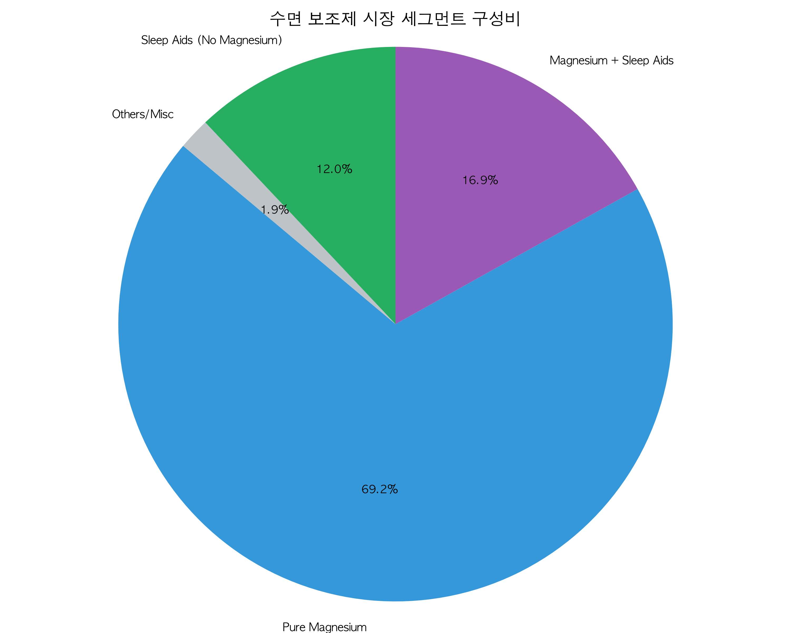

*데이터 인사이트: 전체의 약 70%가 기초 인프라(마그네슘)이며, 나머지 30%가 우리가 기능적으로 차별화할 수 있는 '진짜' 수면제 영역입니다.*

---

## 🔍 03. 마그네슘의 지배력과 '환각'의 실체
### "왜 수면 카테고리가 마그네슘 카테고리가 되었나?"

- **통계적 쏠림**: 리뷰 1~100위 중 마그네슘 포함률은 **93.0%**에 달함.
- **거대 팬덤**: 1위 제품(닥터스베스트 마그네슘)의 리뷰는 약 **18만 건**. 반면 테아닌, 가바 등 기능성 수면 성분 함유 제품은 리뷰가 수백~수천 건 수준.
- **시사점**: 소비자는 '잠'을 위해 마그네슘을 사고 있지만, 이는 이미 **초레드오션**임을 의미. 신규 진입자는 마그네슘 단독 경쟁을 반드시 피해야 함.

---

## 📉 04. 시장 집중도 분석: SKU vs 리뷰 수
### "공급보다 수요가 훨씬 더 기형적으로 쏠린 시장"

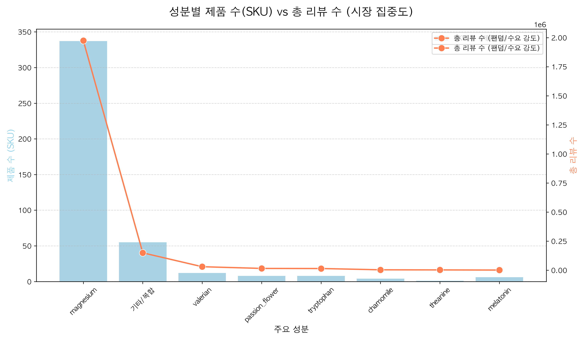

*인사이트: 마그네슘은 SKU 비중(70%)보다 리뷰 비중(90% 이상)이 훨씬 높음. 이는 소비자의 '마그네슘 관성'이 매우 강력함을 시사함.*

---

## 📚 05. 성분 딥다이브: "진짜" 수면 성분 Top 10
### "마그네슘을 걷어내면 보이는 시장의 진짜 실세"

| 순위 | 성분명 | 제품 수 (Frequency) | 시장 포지셔닝 |
| :---: | :--- | :---: | :--- |
| **1** | **글리신 (Glycine)** | 34개 | 마그네슘 흡수 부스터 + 수면 유도 |
| **2** | **발레리안 (Valerian)** | 28개 | 전통 숙면 허브 시장의 1위 |
| **3** | **테아닌 (L-Theanine)** | 24개 | 현대인의 스트레스 완화 수면 |
| **4** | **5-HTP** | 21개 | 감정 이완 및 세로토닌 원료 |
| **5** | **레몬밤 (Lemon Balm)** | 20개 | 안정/이완을 위한 허브 베이스 |
| **6** | **카모마일 (Chamomile)** | 19개 | 자연주의 입문용 성분 |
| **7** | **트립토판 (Tryptophan)** | 18개 | 필수 아미노산 기반 수면 |
| **8** | **아슈와간다** | 8개 | 고급형 웰니스/이완 성분 |
| **9** | **가바 (GABA)** | 7개 | 뇌 신경 안정 (성장이 필요한 영역) |
| **10** | **멜라토닌** | 6개 | 한국 시장 규제 아이템 (대체 성분 타겟) |

---

## 📊 [차트] 전체 수면 성분 분포 (Full Counts)

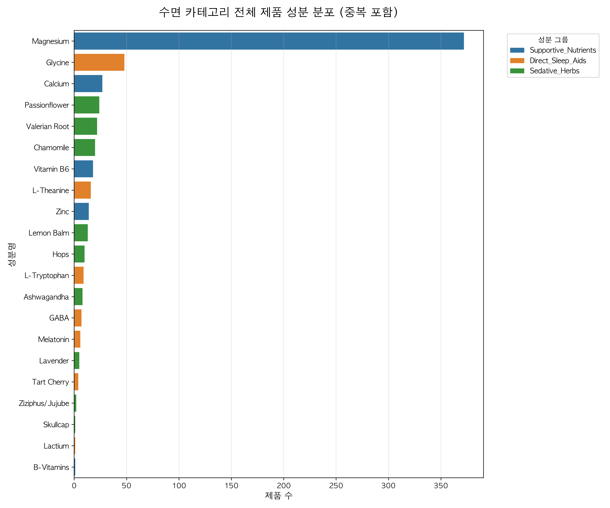

*데이터 인사이트: '글리신'이 1위로 나타난 것은 마그네슘과 결합된 '마그네슘 비스글리시네이트' 형태가 수면 시장의 표준으로 자리 잡았기 때문임.*

---

## 🧬 06. 성분별 상관관계: 'True Occurrence'
### "복합제 속에 숨겨진 조연 성분들을 찾아라"

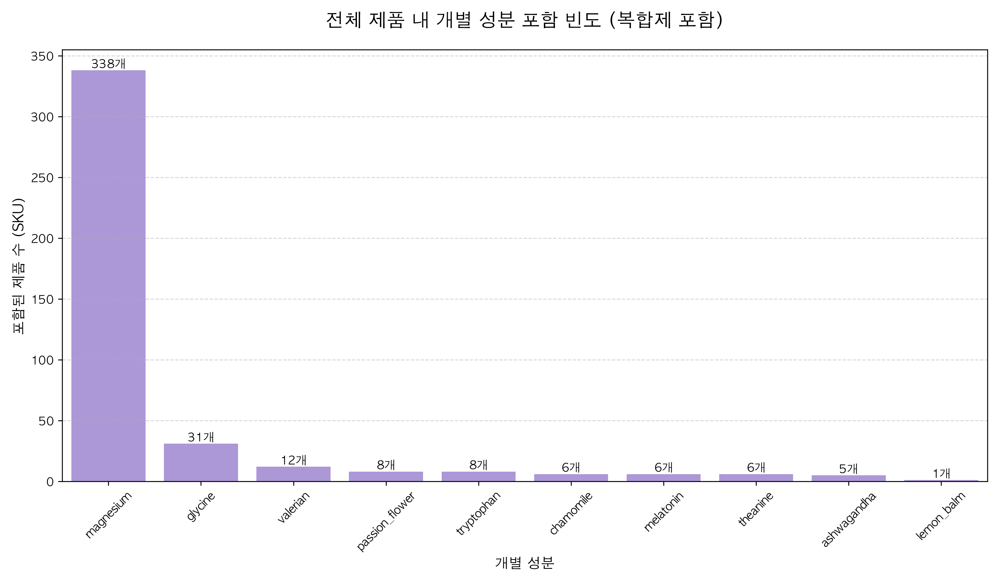

- **테아닌의 재발견**: 단일제로는 드물지만, 복합 포뮬러에 '필수 조연'으로 들어가는 빈도가 매우 높음.
- **시너지 배합**: 상위 제품일수록 단일 성분이 아닌 **'마그네슘 + 글리신 + 테아닌'** 혹은 **'허브 3종 믹스'** 등 시너지 배합을 사용함.

---

## 🧪 07. 마그네슘 형태별 정밀 분석
### "어떤 마그네슘이 수면용인가?"

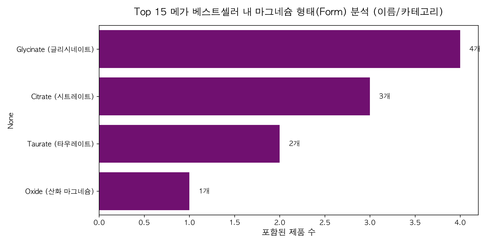

- **산화 마그네슘(Oxide)**: 가성비 중심, 고함량 강조.
- **글리시네이트(Glycinate) ⭐**: 수면 유지력과 근육 이완에 특화. 현재 상위권의 주류.
- **트레온산(Threonate)**: 뇌 장벽 투과 강조, 프리미엄 고가 라인 구축.
- **전략**: 수면 전문 브랜드를 지향한다면 **글리시네이트** 혹은 **트레온산** 기반의 배합이 필수적임.

---

## 💰 08. 수익성 및 가격 분포 (Sweet Spot)
### "소비자가 가격 저항 없이 지출하는 구간은?"

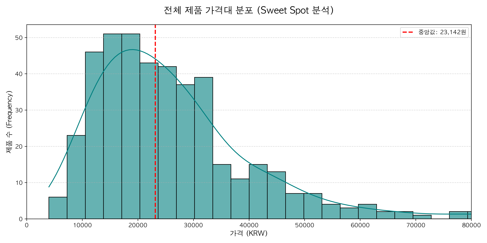

- **1.5만 ~ 3.5만 원**: 전체 제품의 80%가 밀집된 '무저항 구매 구간'.
- **4.5만 원 이상**: 선물용 또는 고기능성 앰플/스틱형 제품이 분포하는 '프리미엄 레벨'.

---

## 📊 09. 성분별 가격 vs 평점 상관관계
### "비쌀수록 평점이 좋을까? 돈값 하는 성분은?"

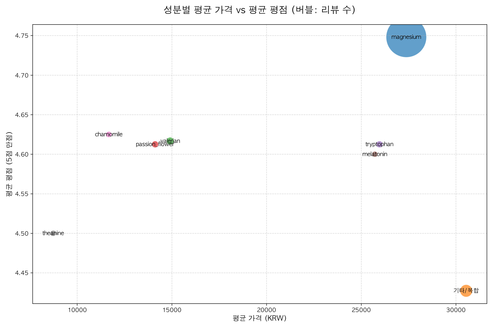

- **마그네슘**: 가격대는 중간(2~3만 원)이지만 평점은 가장 안정적(4.7~4.8).
- **복합 포뮬러(Complex)**: 가격은 비싸지만 평점 편차가 매우 큼. 소비자 기대에 못 미치는 제품이 많다는 방증.
- **블루오션**: **2만 원대 후반에 평점 4.7 이상**을 유지하는 고퀄리티 복합제가 비어있는 틈새임.

---

## 📦 10. 가격 변동성 (Boxplot Analysis)
### "시장에서 가격 표준이 정해진 성분 vs 제각각인 성분"

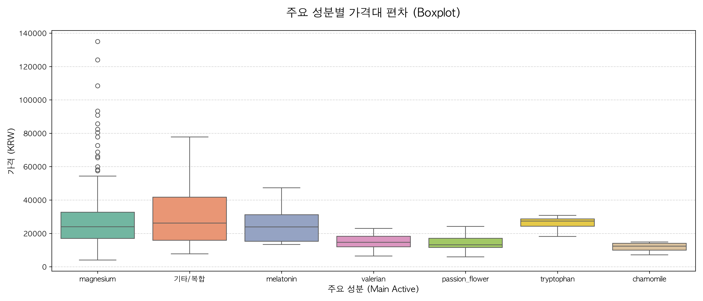

- **마그네슘/글리신**: 박스가 좁고 촘촘함 (가격 경쟁이 심하고 표준화됨).
- **아슈와간다/복합제**: 박스가 매우 넓음 (브랜드와 배합 함량에 따라 가격을 부르는 게 값인 '고마진 영역').

---

## 👨‍👩‍👧‍👦 11. 소비자가 진짜 원하는 것 (Consumer Needs)
### "리뷰 텍스트 4만 건에서 찾아낸 3대 핵심 키워드"

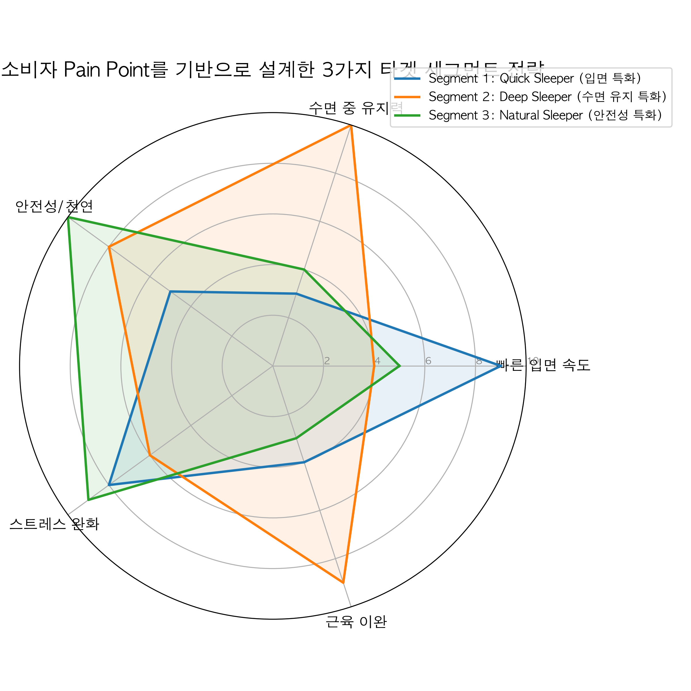

1. **Muscle Relaxation (근육 이완)**: 단순히 잠드는 걸 넘어 몸이 펴지는 느낌.
2. **Next Day Clarity (다음날 개운함)**: 몽롱함(Groggy)이 없는 상쾌한 아침.
3. **No Dependence (무내성)**: 오래 먹어도 의존성이 생기지 않는 자연 유래 성분.

---

## 🔥 12. 성분별 소구 포인트 히트맵 (Heatmap)
### "어떤 성분을 팔 때 어떤 단어를 써야 하는가?"

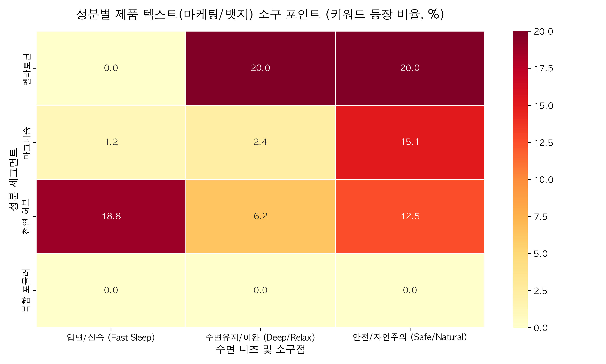

- **마그네슘**: '이완(Relax)', '유지(Deep Sleep)' 키워드에 최적화.
- **천연 허브**: '입면(Fast)', '자연주의(Natural)' 키워드와 찰떡궁합.
- **전략**: 입면이 힘든 고객에겐 **허브**를, 자다 깨는 고객에겐 **마그네슘** 위주의 배합을 추천해야 함.

---

## 🏢 13. 브랜드 지배력 분석 (Market Leader)
### "누가 이 시장의 안방마님인가?"

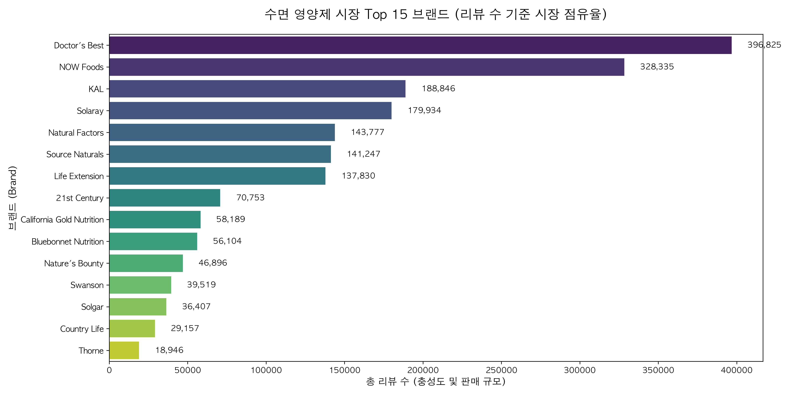

- **Doctor's Best**: 리뷰 수 기준 약 45% 점유. '고흡수 마그네슘' 단일 SKU로 시장 초독식 중.
- **NOW Foods**: 가성비 라인업으로 강력한 추격자.
- **틈새 기회**: 상위 5개 브랜드 모두 '기능성'보다는 '단일 미네랄' 위주. **'수면 전문 부티끄 브랜드'**에 대한 빈자리가 큼.

---

## 🏷️ 14. 소비자의 마음을 여는 열쇠: Badges
### "성분표보다 먼저 보는 신뢰의 증표"

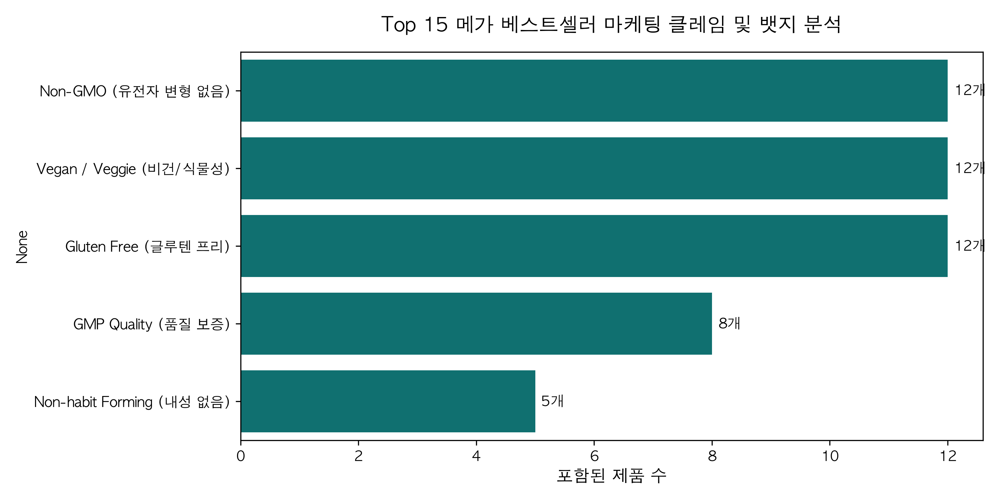

- **필수 뱃지 (Must-have)**: Non-GMO, Vegan, Gluten-Free.
- **한국 특화 뱃지 (Strategic)**: **Melatonin-Free**, Phyto-based.
- **인사이트**: iHerb 이용자들은 제품의 안전성을 증명하는 뱃지에 매우 민감하게 반응함.

---

## 🇰🇷 15. 한국 시장 타겟팅 전략 (Strategy)
### "호르몬제(멜라토닌) 금지를 어떻게 기회로 바꿀 것인가?"

- **현상**: 한국은 멜라토닌 직구 통관이 불가능하여 소비자가 늘 '부족함'을 느낌.
- **역발상 전략**: 
  - **"안전한 대체재"**: 멜라토닌의 부작용(몽롱함, 악몽)을 역으로 강조.
  - **"비-호르몬 수면법"**: 테아닌과 발레리안을 통한 자연스러운 생체 리금 강조.
- **차별화**: 단순히 마그네슘이라 부르지 말고 **"자연 수면 부스터"** 혹은 **"릴랙스 스택"**으로 명명.

---

## 🎯 16. 전략 세그먼트 (1): Quick Sleeper
### "누우면 생각이 많아져서 못 자는 사람들을 위해"

- **타겟**: 2040 직장인, 밤에 스마트폰을 오래 보는 타겟.
- **핵심 성분**: **L-테아닌(고함량) + 가바(GABA) + 타트체리**.
- **제형 추천**: 빠른 흡수를 돕는 '스프레이' 또는 '구미(Gummy)'.
- **가격 목표**: 2.5 ~ 3.5만 원 (구독형 모델 추천).
- **마케팅**: "복잡한 머릿속을 끄는 가장 빠른 스위치."

---

## 🎯 17. 전략 세그먼트 (2): Deep Sleeper
### "한 번 자면 깨지 않고 푹 자고 싶은 사람들을 위해"

- **타겟**: 수면 유지력이 떨어지는 4060 세대, 자도 자도 피곤한 사람.
- **핵심 성분**: **마그네슘 비스글리시네이트 + 글리신 + 발레리안**.
- **차별화**: '킬레이드(Chelated)' 공법을 통한 체내 흡수율 강조.
- **가격 목표**: 3.5 ~ 5.0만 원 (프리미엄 건강기능식품 포지셔닝).
- **마케팅**: "당신의 8시간이 끊기지 않는 기적, 통잠 솔루션."

---

## 🎯 18. 전략 세그먼트 (3): Natural Sleeper
### "약은 싫고, 자연스럽게 건강을 챙기고 싶은 타겟"

- **타겟**: 영양제 입문자, 2030 여성, 웰니스 라이프스타일 지향.
- **핵심 성분**: **카모마일 + 시계꽃(Passionflower) + 레몬밤**.
- **제형 추천**: '수면 차(Tea)' 또는 '아로마 롤온' 패키지 세트.
- **가격 목표**: 1.5 ~ 2.5만 원 (기프트용 라벨 디자인 중요).
- **마케팅**: "매일 밤 나를 위한 순한 위로, 허브 숙면 루틴."

---

## 🚀 19. 실행 로드맵: 4-Step Action Plan
### "데이터 분석을 돈으로 바꾸는 과정"

1.  **Golden Formulation**: [마그네슘 글리시네이트 + 테아닌 + 글리신] 배합으로 초기 시제품 QC 진행.
2.  **Branding**: "Melatonin-Free, Only Natural Ingredients" 뱃지 선확보 및 패키지 적용.
3.  **Pricing Focus**: 매스 마켓(마그네슘)보다는 프리미엄 하이브리드 시장(**3.8만 원**) 타겟팅.
4.  **Growth**: iHerb 내 'Sleep Formula' 하위 카테고리에 'Best for Recovery' 컨셉으로 입점.

---

## 💡 20. 결론 (Executive Summary)

> **"마그네슘은 이미 시장의 기반(Standard)입니다. 우리가 승리하려면 그 기반 위에 '글리신'과 '테아닌'이라는 날카로운 수면 전용 무기를 얹어 '하이브리드 프리미엄'으로 진입해야 합니다."**

*본 리포트의 원시 데이터(Raw-Data)와 추가 차트는 `sleep/data/` 폴더에서 확인할 수 있습니다.*

---
