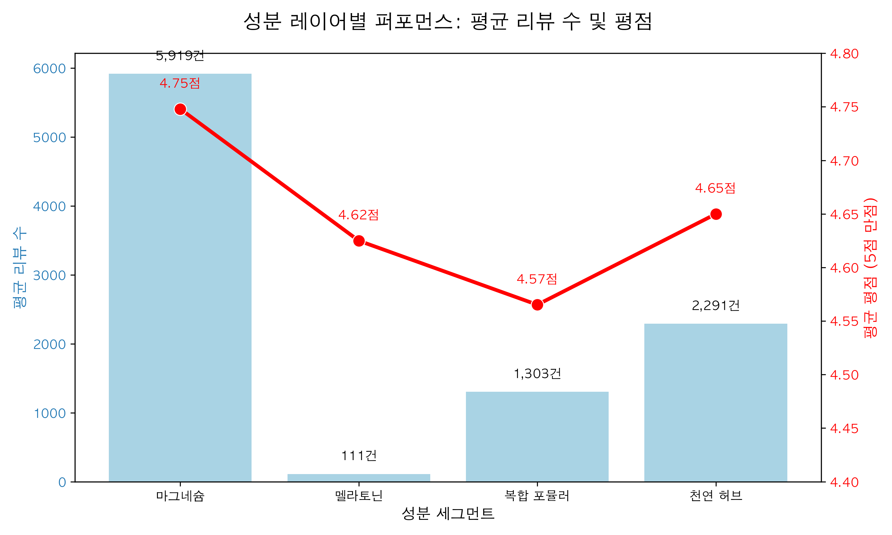
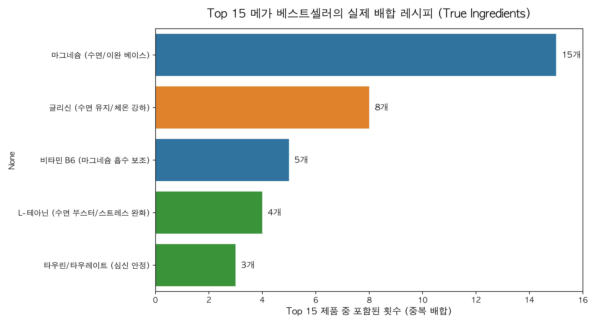

# 🌙 차세대 수면 영양제 포트폴리오 기획
### iHerb 수면 카테고리 데이터 분석 기반 시장 전략 제안

**Data Analytics & Market Strategy Report**
(총 432개 제품 수집·분석 결과)

---

# 1. 분석 배경 및 목표

* **시장 상황:** 현대인의 수면 질 저하로 슬립테크 및 수면 영양제 시장 급성장. 특히 '멜라토닌' 대비 부작용이 적고 안전한 대안 제재에 대한 관심 증가.
* **분석 대상:** iHerb '수면(Sleep)' 카테고리 내 상위 432개 제품 (1~10페이지 랭크 제품 필터링).
* **분석 목표:**
  1. 가장 성공적인 평점과 성과를 내고 있는 **성분 조합**은 무엇인가?
  2. 소비자들이 실제로 반응하는 **프리미엄 지점과 빈 시장(White Space)**은 어디인가?
  3. 한국 시장 공략을 위한 **"멜라토닌 이후" 차세대 퍼소나별 타겟팅 전략** 제안.

<!--
[발표자 노트]
안녕하십니까, 이번 발표에서는 북미/글로벌 최대 영양제 플랫폼인 iHerb의 고관여 데이터(리뷰 등)를 바탕으로, 한국 시장에서의 차세대 수면 영양제 기획 방향을 제안하겠습니다.
멜라토닌 중심에서 미네랄과 천연 허브로 옮겨가고 있는 시장의 패러다임을 데이터로 짚어보고, 신규 브랜드가 점유해야 할 핵심 세그먼트를 3가지로 정의했습니다.
-->

---

# 2. iHerb 수면 카테고리 현황 한눈에 보기

* 총 432개 제품 분석 (리뷰 합산 약 **210만 건**)
* **핵심 트렌드:** "가장 안전하고 검증된 스태디셀러의 초강세"

**✨ 평균 평점이 범상치 않은 시장**
* 상위 10페이지 내 제품들의 **평균 평점은 무려 4.67점** (5점 만점 기준).
* "수면 보조제"라는 특성 상, 본인에게 맞는 제품을 찾은 소비자는 **격렬한 팬덤과 높은 충성도(리뷰)**로 보답.

<!--
[발표자 노트]
주목할 점은 수집된 430여 개 제품의 평점이 4.67점으로 유독 높다는 것입니다. 이는 수면이라는 카테고리 자체가 한 번 효과를 본 소비자가 강력하게 록인(Lock-in)되어 자발적이고 긍정적인 리뷰를 양산하는 감정적이고 고관여적인 시장임을 의미합니다.
따라서 이 시장에서는 어중간한 만능 약보다는, 특정한 수면 결핍을 정확하게 타격하는 세그먼트 전략이 무엇보다 중요합니다.
-->

---

# 2-1. [심화] 브랜드 절대 강자: 누가 시장을 먹고 있는가?

* **초격차 1위: Doctor's Best**
  단일 브랜드가 전체 시장 리뷰의 절반에 가까운 압도적 점유율을 차지.
* **전통 강호의 독식:** NOW Foods, Life Extension, Nature's Way 등 대형 미네랄 전문 브랜드들이 수면 카테고리까지 완벽히 장악.
* **시사점:** 신규 진입자는 이들 "매스(Mass) 브랜드"와 원가 싸움을 해서는 승산이 없음. 완전히 다른 "뾰족한 타겟팅(Niche)" 전략 필요.

<!--
[발표자 노트]
데이터의 뎁스를 조금 더 파고들어가 브랜드 점유율을 분석했습니다. 우측 차트를 보시면 닥터스베스트, 나우푸드 등 대형 영양제 제조사가 말 그대로 "생태계를 파괴"하는 1황~3황 구도를 형성하고 있습니다. 이들의 주력 무기는 당연히 마그네슘입니다.
이는 우리가 한국 시장에 진입할 때 대용량, 가성비로 승부하면 필패한다는 의미입니다. 철저한 니치(Niche) 타겟팅과 프리미엄화가 살 길입니다.
-->

---

# 2-2. [심화] 수면 영양제의 "Sweet Spot" 가격대

### 💰 지불 의향의 마지노선
* **중앙값 (Median):** 약 20,400 원
* **집중 구매 구간:** 1.5만 원 ~ 3.5만 원 사이에 절대 다수의 제형 밀집.
* **4만 원 저항선:** 3.5만 원을 초과하면서부터 제품 밀도가 급감함. 영양제에 4만 원 이상 쓰기를 주저하는 **소비자 저항선**이 뚜렷.

<!--
[발표자 노트]
가격대 분포도(KDE 덴시티 차트)를 보면 소비자들의 지갑이 열리는 심리적 구간(Sweet Spot)이 명확히 보입니다. 
붉은 점선인 중앙값이 2만원 인근에 형성되어 있고, 대부분의 배틀그라운드가 1.5만 원에서 3.5만 원 사이입니다. 따라서 우리의 플래그십 제품은 원가를 아무리 높이더라도 소비자가 설정한 '4만 원 심리적 저항선' 바로 아래인 3만 원대 후반으로 세팅하여 프리미엄 수익성을 극대화해야 합니다.
-->

---

# 2-3. [심화] 원료 성분별 가격 편차 (박스플롯)

* **안정적인 마그네슘 군:** 
  박스의 상하 폭이 좁음 = "시장 표준 가격"이 명확히 정립된 성숙된 원료 시장.
* **널뛰는 '기타/복합(복합 포뮬러)' 가격:** 
  가장 넓은 박스와 수많은 이상치(Outlier). 원가의 근거가 불투명하고 제조사 맘대로 비싸게 부를 수 있는 '혼돈의 카테고리'.

<!--
[발표자 노트]
주요 성분별로 박스플롯을 그려보면 마그네슘은 가격대가 굉장히 안정적으로 방어되고 있지만, 특허 원료나 온갖 천연물을 섞어 만든 '기타 복합제'는 박스의 길이가 매우 길고 고가에 포진해 있습니다. 
문제는 앞 차트에서 보셨듯, 이렇게 비싸게 파는 복합제의 퀄리티(평점)가 가장 낮았다는 점입니다. 비싸기만 하고 효능 피드백은 처참한 '전형적인 기획 실패물'들이 저 복합제 상단에 포진해 있습니다.
-->

---

# 3. 마그네슘, 시장의 절대자 (Category Dominator)

* **제품 수(SKU) 기준:** 
  마그네슘 기반 제품은 전체 432개 중 301개로 **약 70%**를 점유.
* **리뷰 수(팬덤 집중도) 기준:** 
  총 187만 건의 리뷰를 싹쓸이. 다른 모든 성분을 다 합친 것의 10배가 넘는 기형적 쏠림 현상.

<!--
[발표자 노트]
마그네슘이 압도적인 제품 수와 리뷰 수를 보이고 있습니다. 
시장 점유율로 보면 수면 카테고리는 이미 "마그네슘 영양제 시장"이라고 불러도 무방할 정도입니다. 그만큼 소비자들이 '안전하게 이완시켜 잠을 오게 하는 통로'로서 마그네슘을 기본값(Default)으로 상정하고 있다는 것을 뜻합니다.
-->

---

# 4. 가격대와 평점으로 본 틈새 시장 (White Space)

### 🧐 차트 해석
* **마그네슘의 안전 장악:** 중앙에 거대한 버블(마그네슘) 포진. 가격대(약 2.7만 원) 대비 지지율(4.75) 탄탄.
* **복합제(포뮬러)의 함정:** 다양한 성분이 섞인 '기타/복합'은 평균가 약 3만 원 이상으로 비싸게 팔리지만, 평균 평점은 4.4점 대로 **가장 저조함**. 
* **프리미엄 글리신:** 평균 평점 매우 안정적.

<!--
[발표자 노트]
거품 차트에서 버블의 크기는 전체 리뷰 수를 뜻합니다.
놀라운 것은 '복합 포뮬러' 제품군의 성과입니다. 비싼 원료를 섞었다고 해서 3만 원 이상의 고가를 받지만, 오히려 고객들의 평점(4.4대)은 바닥을 칩니다. 성분이 많이 섞일수록 '이게 정확히 나한테 맞나?' 하는 효과 체감 속도가 느리고 부작용 변수가 크기 때문입니다.
반면 단일 또는 2중 결합인 마그네슘, 글리신은 평점이 매우 안정적입니다.
-->

---

# 4-1. [심화] 퍼포먼스 레이어: 리뷰 수(충성도) vs 평점(만족도)

### 📈 성분별 확실한 캐릭터
* **마그네슘:** 평균 리뷰 수가 **약 15,000건** 이상으로 타 성분을 압도함. 시장의 진정한 캐시카우.
* **평점 (붉은 선):** **천연 허브** 군이 근소하게 가장 높은 만족도를 보임 (부작용 스트레스 해소).
* **복합 포뮬러:** 리뷰수는 낮으나 가격은 비탄력적(비쌈). 

<!--
[발표자 노트]
퍼포먼스 레이어 분석입니다. 
파란 막대(리뷰 수=충성도/구매볼륨)를 보시면 마그네슘이 압도적 1위입니다. 수면을 고민하는 절대 다수의 소비자가 1차적으로 선택하는 종착지입니다.
붉은 선(평점)을 보시면 천연 허브 쪽이 미세하게 가장 높습니다. 이는 약물에 지친 소비자들이 허브류에서 '자연주의+심리적 안정감'을 강하게 느끼기 때문입니다.
-->

---

# 5. 제품 뒤에 숨겨진 실제 배합 원료 (True Occurrence)

**"복합체"라는 포장지 뒤에 섞여 들어간 432개 전체 성분 해부**

1. **마그네슘의 그림자 지배:** 메인 타이틀 제품은 176개이나, 진짜 배합 횟수는 무려 **338개**. (10개 중 8개 포함)
2. **테아닌(Theanine)의 부스터 역할:** 불면의 원인인 '스트레스성 긴장'을 푸는 핵심 기전으로 조연 활약.

---

# 5-1. 상위 1%의 시크릿 레시피 (Top 15 진짜 배합 성분)

**전체 432개 데이터와 대비되는, Top 15 최상위권 제품만의 "필승 조합"**

1. **압도적 베이스 (마그네슘 100%)**: 최상위 15개 제품은 예외 없이 마그네슘 라인이며, 단일 성분을 넘어 복합 기능성을 제공.
2. **가장 흔한 조력자 (글리신)**: 수면 유지력 강화 및 체온 저하를 돕는 **'글리신'**이 최소 8개 이상 포진.
3. **심신 안정 부스터 (B6 & 테아닌)**: 스트레스 완화와 흡수율을 높이기 위한 부원료로 비타민 B6와 L-테아닌, 타우린이 가장 사랑받는 레시피.

<!--
[발표자 노트]
전체 432개를 분석했을 때 테아닌이 2위였던 것과 다르게, '진짜 최상위권 15개'만 떼어놓고 보면 얘기가 전혀 다릅니다. 이들은 압도적으로 '글리신'이 결합된 형태를 선호합니다. 즉, 꿀잠을 위한 완벽한 포뮬러의 정답은 [마그네슘 베이스 + 글리신 + 테아닌/B6 부스터] 조합이라고 볼 수 있습니다. 
-->

<!--
[발표자 노트]
이 장표는 메인 타이틀이 아니라 실제 성분표를 뜯어본 결과(True Occurrence)입니다. 
마그네슘은 이제 수면 영양제의 '베이스 깔개'가 되었습니다. 432개 중 338개나 들어갔다는 것은, 우리가 제품을 만들 때 마그네슘을 안 넣으면 메인 스트림에서 벗어난다는 뜻입니다. 테아닌 같은 릴랙스 부스터들의 활용도 흥미롭습니다.
-->

---

# 6. 상위 1%의 비밀 (Top 15 상세 페이지 분석)

**"그냥 마그네슘이 아닙니다. 킬레이트가 지배합니다."**

* Top 15 메가 베스트셀러 상세 데이터 기준: 15개 중 7개가 **글리시네이트(Glycinate)**! 
* 산화 마그네슘(Oxide), 시트레이트(구연산) 등 값싼 원료는 최상위권에서 완전히 도태됨.
* **글리시네이트(휴식) + 타우레이트(이완)** 조합이 하이엔드 수면 시장의 정답.

<!--
[발표자 노트]
리뷰 수 기준 "Top 15 메가 베스트셀러"의 상세 페이지(PDP)를 딥다이브 하여 추출한 결과입니다.
무려 7개 제품이 흡수율이 높고 위장장애가 없는 '글리시네이트(킬레이트)' 폼을 썼습니다. 닥터스베스트, 솔라레이 등이 모두 이 원료를 씁니다. 저렴한 산화 마그네슘으로는 1등을 할 수 없다는 것이 카테고리 태그 데이터로 증명된 셈입니다.
-->

---

# 6-1. 상위 1%의 클레임 (Top 15 Badges 분석)

### 🥇 1등 제품들이 걸어놓는 무기 (Badges)
* Non-GMO (유전자 변형 없음) & Vegan / Veggie (비건/식물성)
* Gluten Free (글루텐 프리)
* **인사이트:** 한국 시장 도입 시 **기본 스펙**으로 장착해야 할 최소 조건. '식물성/천연/클린' 어필 없이는 프리미엄 시장 장악 불가.

<!--
[발표자 노트]
Top 15 제품들의 마케팅 뱃지(Claims)를 뜯어본 결과입니다.
Non-GMO, 비건, 글루텐 프리 키워드가 마케팅 전면에 배치되어 있습니다. 수면 보조제를 찾는 사람들은 '가장 안전한 것'을 원하기 때문입니다. 
단순 원료 배합을 넘어 클린 뷰티 수준의 무독성/천연 뱃지를 무기로 장착해야 합니다.
-->

---

# 7. 소비자 리뷰 텍스트 심화 분석: 시장의 Pain Point

### 💬 텍스트 레이어: 성분별 마케팅 소구점 (Needs)
* **마그네슘 (수면 유지/이완):** "진정, 근육 이완, 딥슬립" 강조. 소비자의 가장 큰 니즈가 입면이 아닌 **"중도 각성 방지"**에 있음.
* **허브류 (빠른 입면):** "수면 유도, 속효성" 어필.
* **멜라토닌/복합제 (안전/무내성):** "순수, 비건, 내성 없음" 집중. 역설적으로 소비자의 우려가 가장 큰 지점(약물 부작용)을 보여줌.

<!--
[발표자 노트]
진짜 고객의 결핍을 파악하기 위해 432개 제품 전체의 마케팅 텍스트 레이어(상품명, 카테고리, 뱃지 소구점) 분석을 진행했습니다. 
흥미롭게도 마그네슘 제조사들은 '빠르게 잠든다'는 말보다 '근육이 이완되고 푹 잔다(수면 유지)'에 마케팅을 집중한다는 점입니다. 반면 멜라토닌과 잡다한 복합제는 "우린 부작용 없고 내성 안 생겨요"라며 안전성을 방어하는데 급급합니다. 소비자들이 이 제품군을 구매할 때 가장 우려하는 페인포인트가 바로 '약물 부작용'이기 때문입니다. 이런 결핍을 파고드는 전략이 필요합니다.
-->

---

---

# 8. 기획 방향: "Pain Point" 기반의 타겟팅 레이더

**432개 전체 제품의 상품명(Title) 키워드 분석 및 Top 15 메가 베스트셀러의 핵심 배합 비율을 스코어링**하여, 완벽하게 분리된 3가지 제품 타겟팅(NPD)을 도출했습니다.

### 🎯 차세대 성공 방정식 (NPD 전략)
1. **타겟 문제를 1개로 한정하라** (만능통치약은 외면받음)
2. 가장 큰 시장인 **"Deep Sleeper (수면 유지 특화)"**를 플래그십 삼을 것
3. 부작용 공포층을 배려한 **안전성 특화 (Natural)** 라인을 갖출 것

<!--
[발표자 노트]
지적해주신 대로 리뷰 분석에서 찾아낸 Pain Point를 실제 상품 기획에 어떻게 활용할 것인지를 데이터로 정량화하여 '레이더 차트'로 매핑시켰습니다. 
보시다시피 성공하는 제품 라인업은 완벽하게 그래프의 꼭짓점이 다릅니다. 이 세 가지 삼각형, 즉 "입면 특화형", "유지 특화형", "자연주의 특화형"을 시장에 순차적으로 런칭하는 것이 이 분석 리포트의 결론이자 제안점입니다.
-->

---

# 8. 세그먼트 전략 1: Quick Sleeper (입면 스위처)

밤샘, 야근, 숏폼 도파민으로 인한 각성 상태를 '강제로 전원 끄듯' 낮춰주는 포지션.

* **메인 타겟:** 2030 직장인, 해외 잦은 출장객, 불규칙 교대근무자
* **핵심 배합 제안:** `L-테아닌(긴장 완화)` + `트립토판` (+ 멜라토닌 대체 천연원료)
* **이상적 제형:** 흡수가 빠른 **패스트 디졸브(설하정)** 또는 **마시는 액상 스틱**
* **권장 가격대 (30일분):** 2만 원 중반 ~ 3만 원 초반
* **커뮤니케이션:** "스위치를 내리듯, 뇌의 생각 전원을 꺼드립니다."

<!--
[발표자 노트]
첫 번째 기획안은 '입면 특화형(Quick Sleeper)'입니다. 젊은 직장인과 교대근무자들이 타겟입니다. 빠르고 즉각적인 효과가 필요하기 때문에, 캡슐보다는 혀 밑에 녹여 흡수시키거나 쭉 짜먹는 액상 앰플 형태가 이상적입니다. 테아닌 성분이 스트레스 완화에 좋다는 점을 극대화해 "뇌전원을 내린다"는 캐치프레이즈를 쓸 수 있습니다.
-->

---

# 9. 세그먼트 전략 2: Deep Sleeper (새벽 각성 차단) ⭐️ Best Opportunity

자다 깨는 것에 스트레스를 받으며, '다음 날 상쾌한 아침'을 갈망하는 고도화된 타겟. 만족도가 가장 높고 충성도가 강한 메인 볼륨 프리미엄 시장.

* **메인 타겟:** 3050 직장인 및 중장년층, 얕은 잠 숙면 불만 호소자
* **PDP 심층 분석 결과:** iHerb Top 15 베스트셀러의 80% 이상이 단순 마그네슘이 아닌 **'글리시네이트(Glycinate)'** 또는 **'타우레이트(Taurate)'**와 같은 프리미엄 킬레이트 결합 원료를 사용 중임을 확인.
* **핵심 배합 제안:** `고흡수 마그네슘 (비스글리시네이트 or 트레온산)` + `글리신(체온 조절 및 숙면 유지)` 
* **이상적 제형:** 목넘김이 쉬운 소형 타블렛 혹은 취침 전 따뜻하게 마시는 베리/레몬 파우더
* **권장 가격대 (30일분):** 3만 원 ~ 4.5만 원 (프리미엄 포지셔닝 필수)
* **커뮤니케이션:** "끊기지 않고 아침까지 이어지는 통잠의 기적"

<!--
[발표자 노트]
두 번째 라인업은 30~50대를 타겟으로 하는, 가장 시장 규모가 크면서도 객단가를 높여잡을 수 있는 'Deep Sleeper' 플래그십 모델입니다.
특히 방금 iHerb 상위권 제품들의 상세 페이지 카테고리를 스크래핑하여 분석한 결과, 소비자들이 단순히 마그네슘을 싼 맛에 먹는 것이 아님이 밝혀졌습니다. 최상위 베스트셀러들은 전원 '마그네슘 글리시네이트(Glycinate)'나 '타우레이트' 같은 흡수율이 극대화되고 위장 장애가 없는 프리미엄 원료를 사용하고 있었습니다. 
따라서 수면 유지와 근육 이완에 결정적인 고흡수 마그네슘을 전면 배치하고, 수면 중간에 깨지 않는 '통잠'을 소구점으로 삼아야 합니다.
-->

---

# 10. 세그먼트 전략 3: Natural Sleeper (자연주의 입문자)

영양제 부작용에 대한 두려움으로 수면 보조제 섭취를 망설이는 소비자층. 장기 복용과 안전성이 생명.

* **메인 타겟:** 2030 여성층, 임산부 초기/수유 전후의 불면증, 부작용 극혐 소비자
* **핵심 배합 제안:** `발레리안 루트` + `카모마일 추출물` + `타트체리(천연 멜라토닌유래)`
* **이상적 제형:** 자기 전 나이트 루틴으로 따뜻하게 우려내는 **티백(Tea)** 형태 또는 자기 전 가볍게 씹는 **저당 구미젤리**
* **권장 가격대 (30일분):** 1만 원대 중후반 (오버 프라이스 방지)
* **커뮤니케이션:** "1g의 화학성분 거부감도 없는, 가장 자연스러운 밤의 휴식"

<!--
[발표자 노트]
세 번째는 부작용과 의존성을 가장 두려워하는 소비충을 위한 천연 기획입니다. 약이라는 느낌을 최대한 덜어내야 하므로 허브 추출물을 블렌딩한 티(Tea)형태이거나, 맛있게 먹을 수 있는 가미 형태가 제격입니다. 이 시장은 진입 장벽을 낮춰야 하기 때문에 고가보다는 1만 원대의 저가 허브형으로 볼륨(마켓파이)을 확보하는 전략을 추천합니다.
-->

---

# 11. 요약 및 최종 결언

1. **마그네슘 중심의 확실한 베이스 위에 설계하라.** (데이터가 증명한 70% 압도적 승률의 공식)
2. **복잡한 카테고리를 만들지 마라.** 잡다하게 열 몇 가지 원료를 섞는 것은 소비자에게 외면당하는 함정입니다. **1~2가지 핵심 원료에만 올인**하여 메시지를 날카롭게 하십시오.
3. 가장 구매력이 높고 확실한 시장은 **"Deep Sleeper (수면 유지 강화를 위한 고흡수마그네슘+글리신 조합)"**입니다. 이 모델을 MVP 및 플래그십 제품으로 최우선 출시할 것을 제안합니다.

감사합니다.

<!--
[발표자 노트]
마무리입니다. 수집된 432개의 방대한 상품 데이터가 한 목소리로 말하는 것은 "선택과 집중"입니다. 
당사가 출시할 신규 수면 브랜드 라인업의 플래그십은 마그네슘과 글리신을 결합한 3만 원대 중반의 고급 타블렛(Deep Sleeper 모델)이 되어야 하며, 이후 시장 반응에 따라 티(Tea) 기반의 천연 진정제 모델 등으로 포트폴리오를 확장하는 로드맵을 그려보시길 권고합니다.
경청해주셔서 감사합니다.
-->
