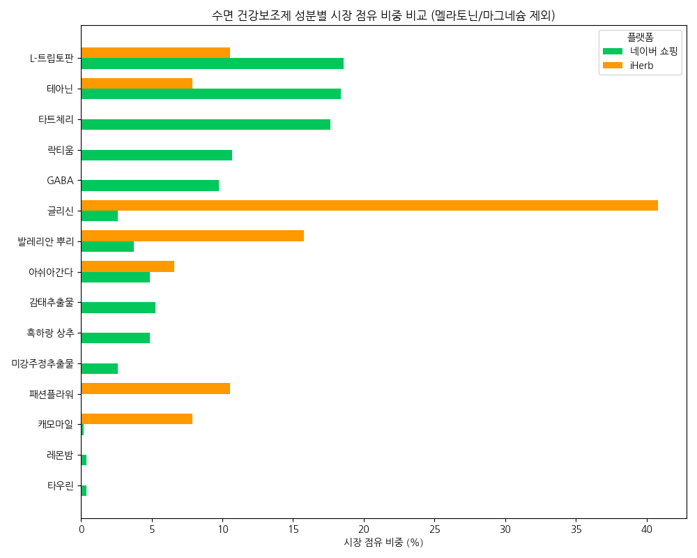

# 수면 건강보조제 시장 분석 결과 보고서

이 보고서는 네이버 쇼핑(국내)과 iHerb(해외 직구) 데이터를 비교 분석하여 수면 관련 성분 시장의 특징을 요약한 결과입니다.

## 분석 개요
- **대상**: 네이버 쇼핑 (`sleep_supplements.csv`), iHerb (`iherb_true_ingredient_frequency.csv`)
- **방법**: 상품명 및 성분 리스트 파싱, 성분명 표준화(Korean Canonical Mapping)
- **제외**: 멜라토닌(Melatonin), 마그네슘(Magnesium)

## 성분명 표준화 내역
| 영문명 | 표준 한국어 성분명 |
|:---|:---|
| L-theanine / Theanine | 테아닌 |
| Valerian / Valerian root | 발레리안 뿌리 |
| GABA | GABA |
| Ashwagandha | 아쉬아간다 |
| L-tryptophan / Tryptophan | L-트립토판 |
| Tart cherry | 타트체리 |
| Lactium | 락티움 |
| Ecklonia cava | 감태추출물 |

## 시장 점유 비중 비교 (상위 15개 성분)

| 성분명 | 네이버 점유율 (%) | iHerb 점유율 (%) | 비고 |
|:---|---:|---:|:---|
| L-트립토판 | 18.57 | 10.53 | 양측 공통 인기 |
| 테아닌 | 18.39 | 7.89 | 국내 선호도 높음 |
| 타트체리 | 17.64 | 0.00 | 국내 특화 성분 |
| 글리신 | 2.63 | 40.79 | iHerb 압도적 1위 |
| 발레리안 뿌리 | 3.75 | 15.79 | iHerb 선호 |
| 락티움 | 10.69 | 0.00 | 국내 한정 인기 |

## 주요 분석 결과
- **플랫폼별 다양성**: 네이버 쇼핑(14종)이 iHerb(7종)보다 더 다양한 마케팅 소구 성분을 사용하고 있습니다.
- **국내 특화 성분**: 타트체리, 락티움, 감태추출물, 흑하랑 상추 등은 국내 네이버 쇼핑에서만 유의미한 비중을 차지합니다.
- **해외 특화 성분**: 글리신은 iHerb에서 40% 이상의 비중을 차지하는 핵심 성분이나, 국내에서는 인지도가 상대적으로 낮습니다.

## 비즈니스 인사이트 (Business Insight)
현재 국내 수면 보조제 시장은 테아닌, 타트체리, 락티움 등 일반 식품 기반의 친숙한 원료가 주류를 이루고 있습니다. 이는 국내 건강기능식품법상의 엄격한 원료 규제와 더불어 한국 소비자 특유의 '천연 유유래 성분'에 대한 높은 신뢰도가 결합된 결과로 해석됩니다. 반면, iHerb로 대표되는 해외 직구 시장은 글리신(40.8%), 발레리안 뿌리(15.8%) 등 고기능성 단일 아미노산 및 전통적인 서양 허브 성분이 시장의 절반 이상을 장악하고 있습니다. 특히 글리신은 해외에서 핵심적인 수면 성분으로 자리 잡았으나 국내 점유율은 2.6%에 불과해, 시장 내 정보 비대칭성과 플랫폼별 선호 차이가 극명하게 나타납니다. 이러한 경향은 국내 소비자들이 점차 직구를 통해 전문적인 영양 지식을 습득함에 따라, 향후 국내 시장에서도 단순 보조제를 넘어선 고농축·전문 성분으로의 기술적 전환이 가속화될 것임을 시사합니다.

## 비즈니스 전략 제안 (Business Proposal)
1. **글리신(Glycine) 및 고기능성 아미노산 시장 선점**: 해외 시장에서 검증된 글리신의 효능을 국내 소비자에게 적극 홍보하고, 이를 핵심 성분으로 하는 프리미엄 복합제를 출시하여 시장의 '전문화' 트렌드를 리드해야 합니다.
2. **국내 특화 성분의 글로벌 플랫폼 하이재킹**: 락티움, 감태, 흑하랑 상추 등 국내에서 검증된 독자적 성분들을 iHerb 등 글로벌 플랫폼에 'K-Sleep' 솔루션으로 역제안하여 북미 및 유럽 시장의 신규 수요를 창출할 수 있습니다.
3. **전문가 컨셉의 고부가가치 라인업 구축**: 현재의 '식품형' 구성을 탈피하여, 고순도 아미노산이나 가공 허브 추출물을 강조한 병원/약국 전용 컨셉의 고부가가치 제품군을 출시함으로써 브랜드의 기술적 신뢰도를 확보해야 합니다.
4. **MZ세대의 직구 트렌드 내재화 전략**: 직구에 익숙한 젊은 세대를 타겟으로 iHerb 인기 성분(아쉬아간다, 글리신 등)을 국내 제조 기술로 완벽히 구현한 '직구급 성능'의 스피디한 신제품 런칭을 제안합니다.

---
**분석 데이터 파일**: [/Users/haileynoh/Documents/fcicb7/sleep/data/sleep_ingredient_market_share.csv](file:///Users/haileynoh/Documents/fcicb7/sleep/data/sleep_ingredient_market_share.csv)
