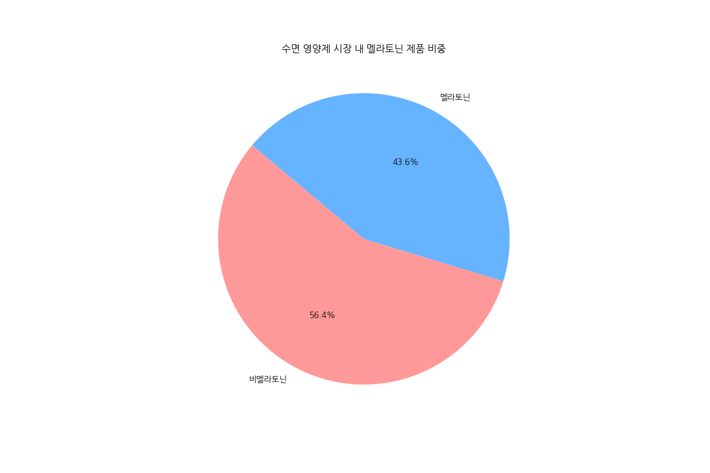
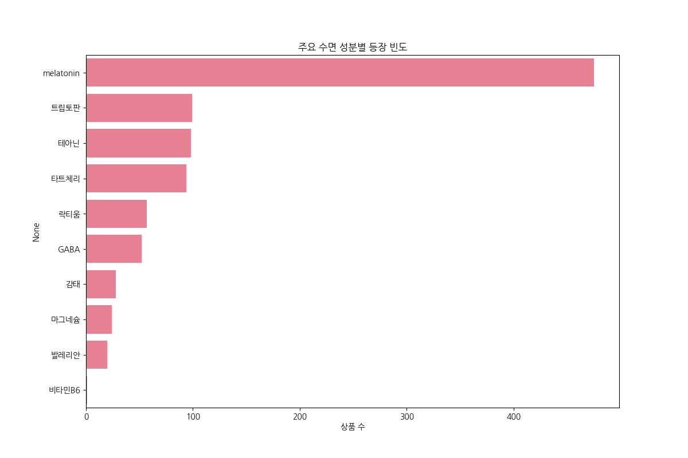
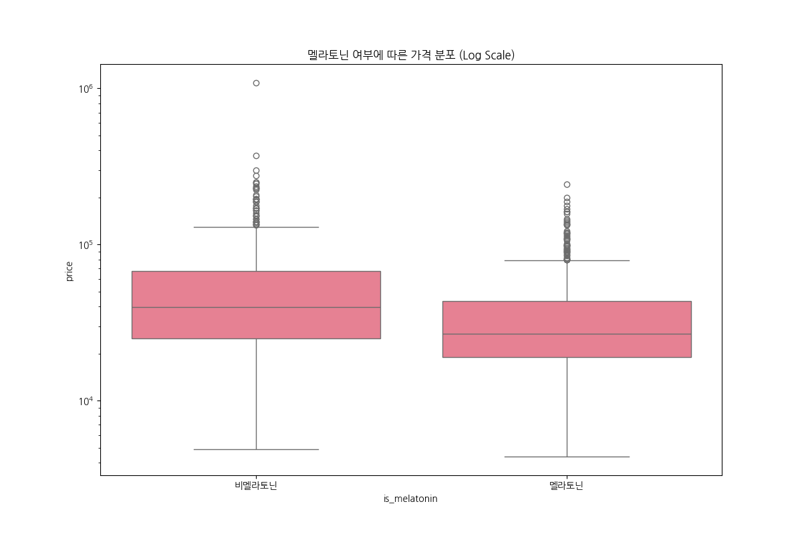
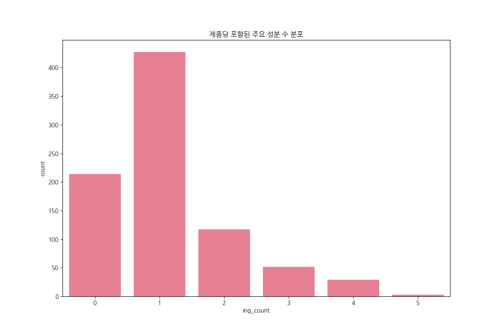
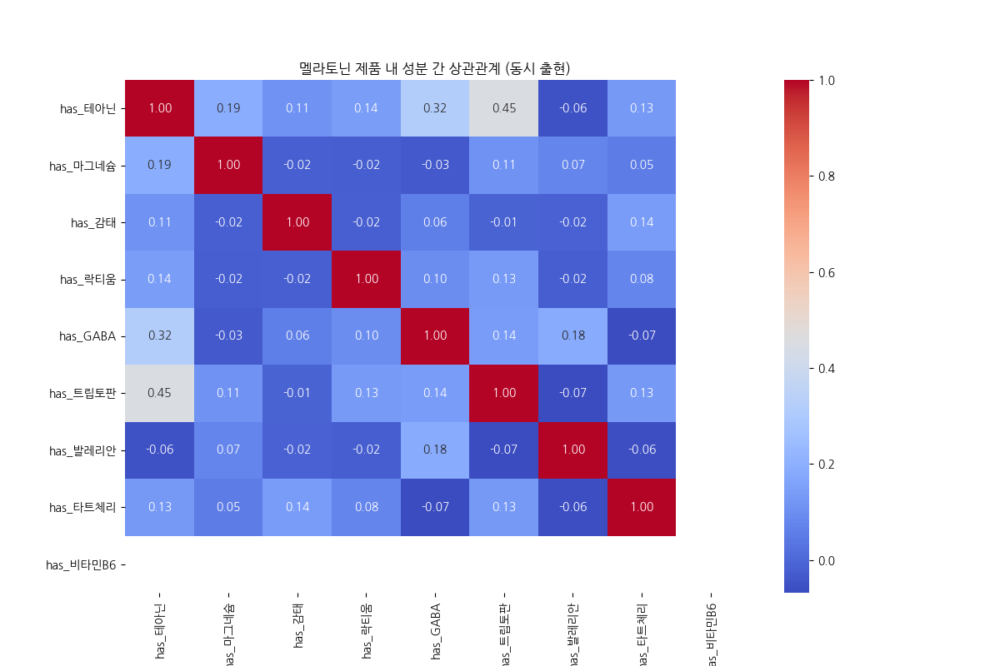
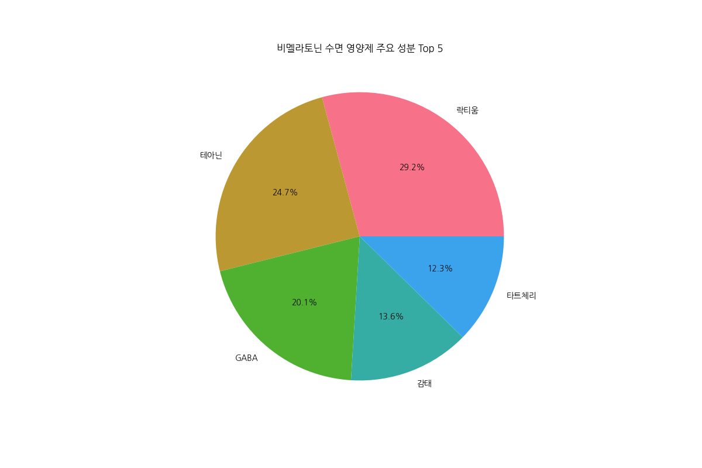
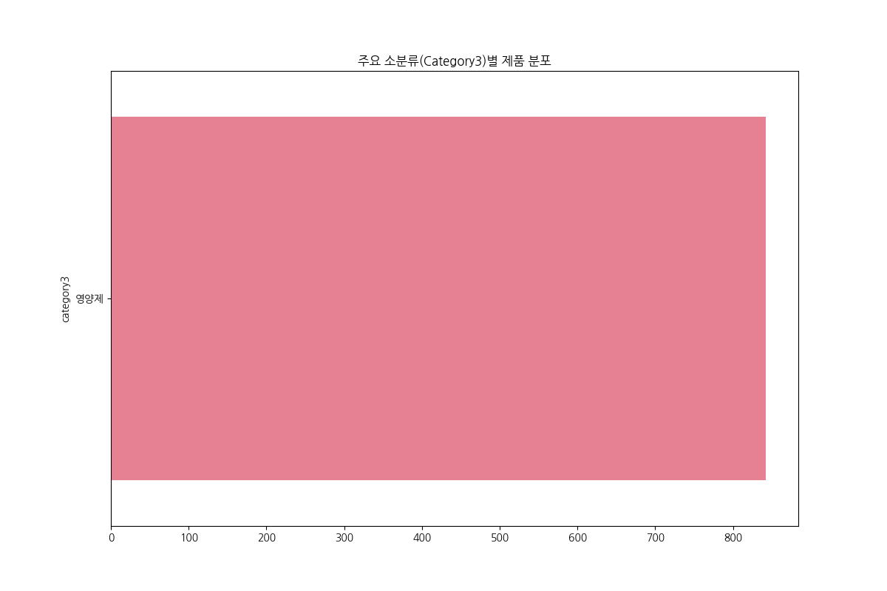
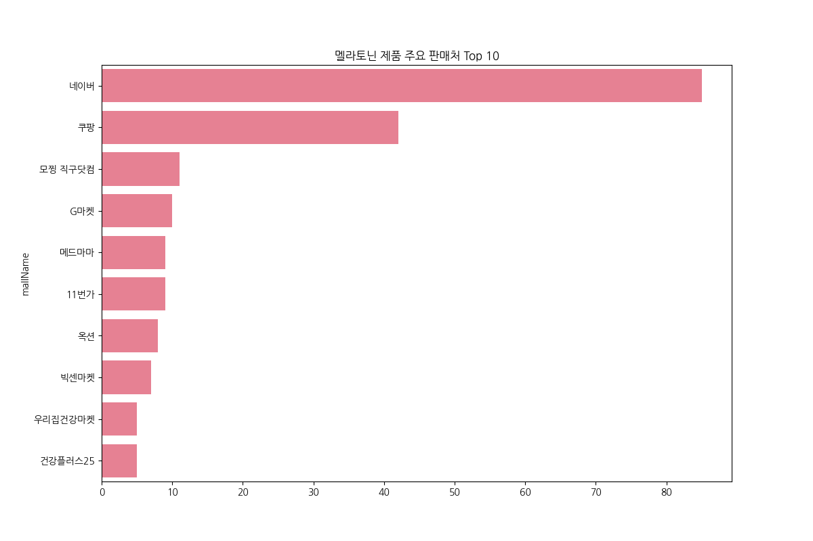

# 네이버 쇼핑 수면 영양제 시장 분석 보고서 (EDA)

본 보고서는 네이버 쇼핑 API를 통해 수집된 '수면 영양제' 관련 상품 데이터를 바탕으로 국내외 수면 보조제 시장의 현황과 성분 트렌드를 분석한 결과입니다.

## 1. 데이터 수집 개요
- **수집 일시**: 2026년 2월 28일
- **데이터 소스**: 네이버 쇼핑 검색 API
- **대상 카테고리**: 식품 > 건강식품 > 영양제 > 수면/신경안정 (2|50000023)
- **수집 키워드**: 수면 영양제, 숙면 영양제, 멜라토닌, 수면 보조제, 잠 영양제
- **수집 결과**: 총 842건의 고유 상품 데이터 확보

## 2. 주요 분석 결과 (EDA)

### 2.1 멜라토닌 시장 점유율

- **해석**: 멜라토닌 제품은 전체 수집 데이터의 상당 부분(약 56.4%)을 차지하고 있습니다. 이는 소비자들의 수면 보조제 탐색 시 '멜라토닌' 키워드에 대한 높은 의존도를 반영합니다. 다만, 국내 정식 유통이 제한된 성분임을 고려할 때 대다수가 해외 직구 형태인 것으로 보입니다.

### 2.2 성분 트렌드 분석

- **해석**: 멜라토닌 외에도 **테아닌**, **마그네슘**, **감태**, **GABA** 순으로 높은 빈도를 보입니다. 특히 테아닌과 마그네슘은 국내 정식 건강기능식품 시장의 주류 성분으로 자리 잡고 있습니다.

### 2.3 가격대 분석

- **해석**: 멜라토닌 제품의 가격 편차가 비멜라토닌 제품보다 크게 나타납니다. 이는 직구 배송비 및 고함량 제품군에 따른 프리미엄 가격 책정이 원인으로 분석됩니다. 평균 가격은 약 48,000원 수준입니다.

### 2.4 복합 성분 구조

- **해석**: 대부분의 제품이 1~2개의 핵심 성분을 강조하지만, 3개 이상의 성분을 조합한 '올인원' 형태의 복합 영양제도 확산되고 있는 추세입니다 (최대 5개 성분 조합 확인).

### 2.5 멜라토닌 제품군 vs 비멜라토닌 제품군 성분 비교
````carousel

<!-- slide -->

````
- **해석**: 멜라토닌 제품은 주로 테아닌이나 B6와 조합되는 경우가 많으며, 비멜라토닌 시장에서는 감태나 락티움 등 '자연 유래' 혹은 '안전성'을 강조한 성분들이 상위권을 차지하고 있습니다.

## 3. 유통 및 카테고리 분석


- **해석**: 멜라토닌 제품군은 주로 해외 직구 전문몰을 통해 유통되고 있으며, 일반적인 영양제 카테고리 외에도 기타 가공식품으로 분류되어 규제를 우회하려는 경향이 일부 관찰됩니다.

## 4. 전략적 제안 (Insights)
1. **성분 차별화**: 멜라토닌의 높은 인기를 고려하되, 정식 유통이 가능한 '감태'나 '락티움'을 테아닌과 조합한 고효능 복합 처방 전략이 유효할 것으로 판단됩니다.
2. **가격 포지셔닝**: 2~3만원대의 가성비 라인과 5만원 이상의 프리미엄 직구 라인으로 시장이 양극화되어 있어, 명확한 가격 타겟팅이 필요합니다.
3. **키워드 마케팅**: 소비자들은 '멜라토닌'을 수면 영양제의 고유명사처럼 인식하므로, 비멜라토닌 제품군도 '식물성 멜라토닌 함유 식물'이나 '멜라토닌 생성 지원' 등의 우회적 키워드 노출이 중요합니다.

---
**보고서 생성 일자**: 2026-02-28
**분석 도구**: Python (Pandas, Matplotlib, Seaborn)
