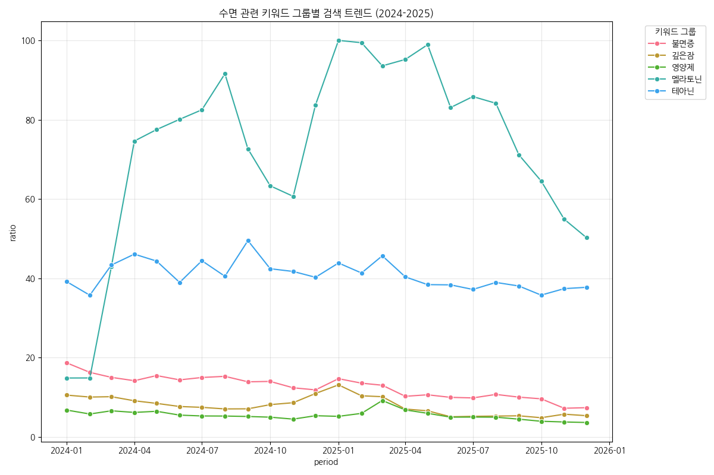
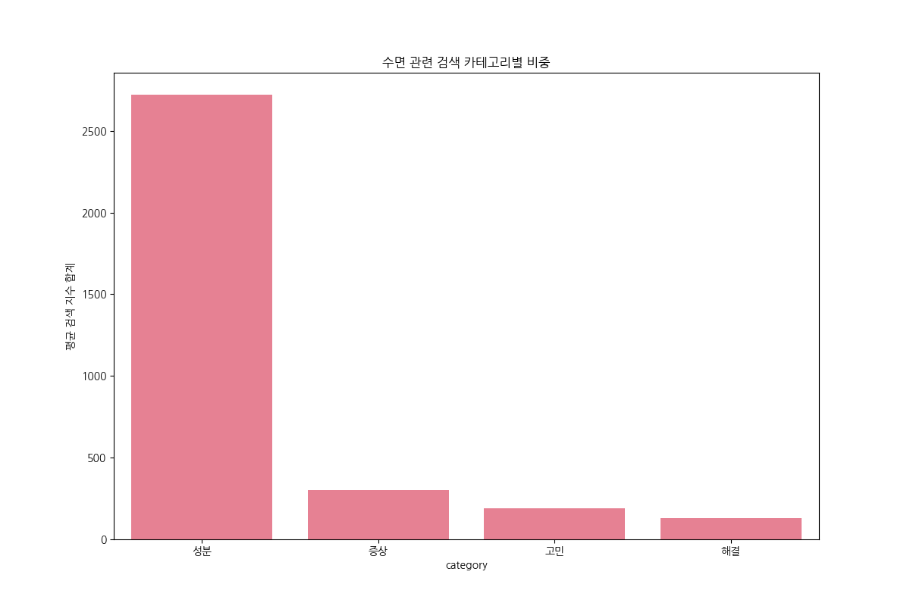
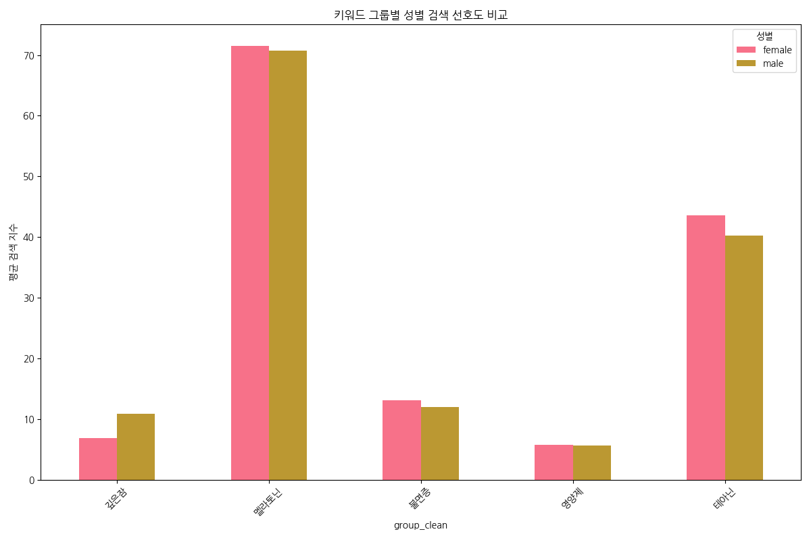
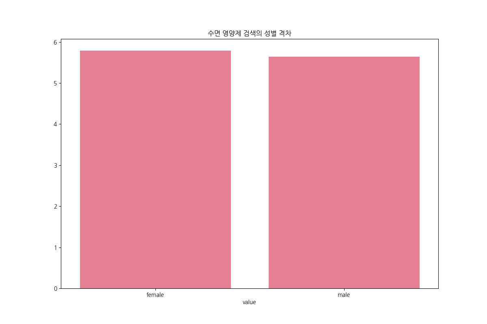
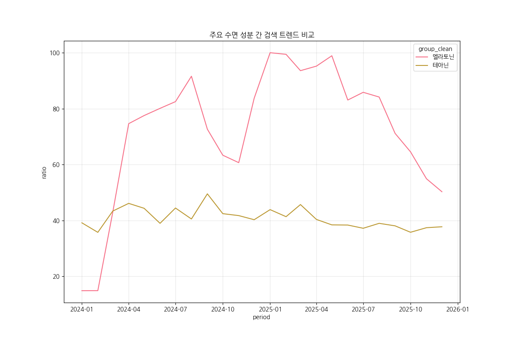
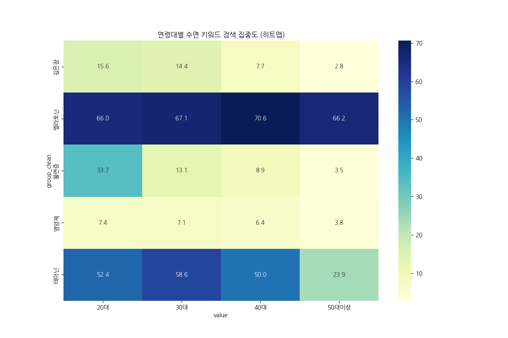
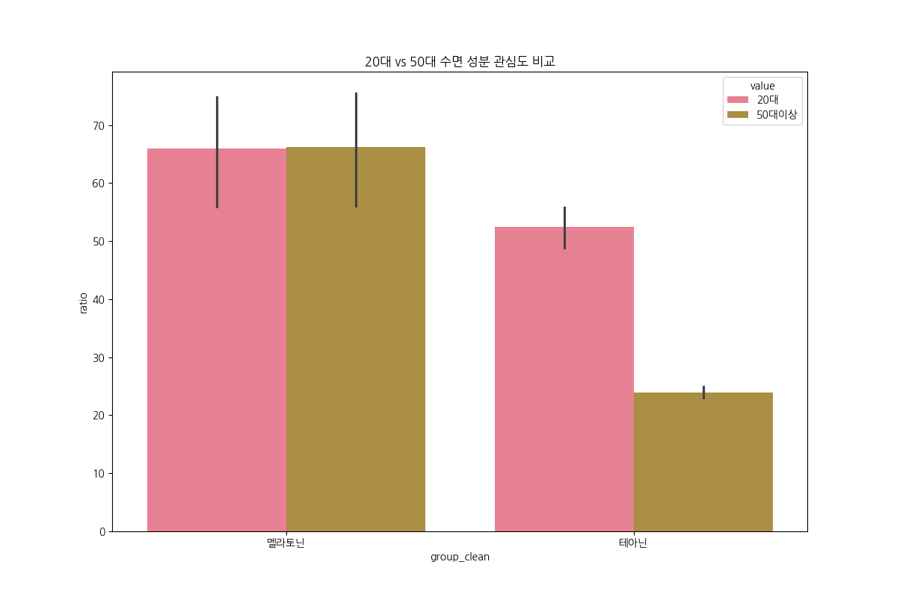
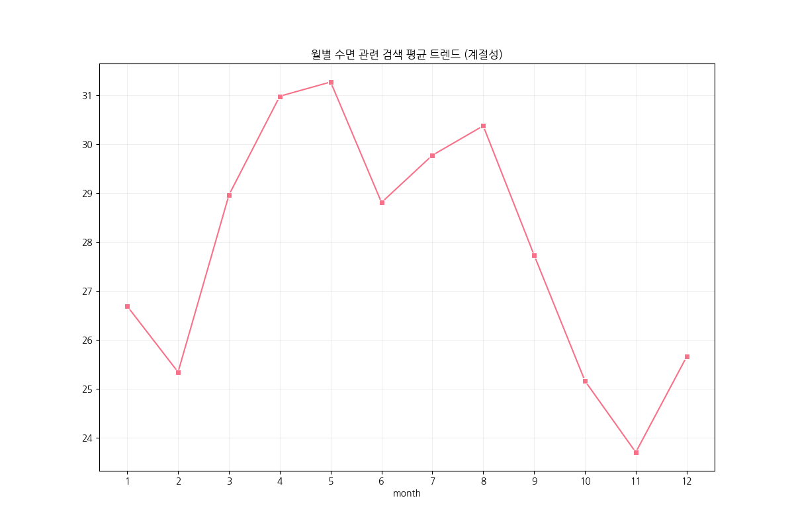
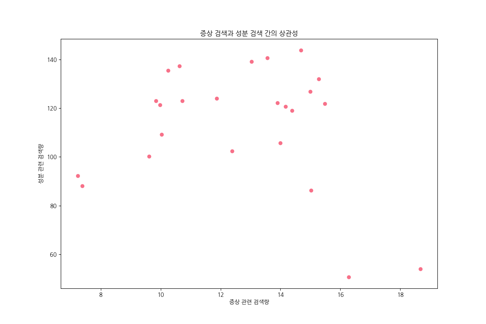

# 네이버 검색 트렌드 기반 수면 건강 고민 및 성분 분석 보고서

본 보고서는 네이버 데이터랩 API를 통해 2024년 1월부터 2025년 12월까지의 '수면' 관련 검색 트렌드를 분석하여, 소비자들의 건강 고민과 성분 선호도를 인구통계학적 관점에서 도출한 결과입니다.

## 1. 분석 개요
- **분석 기간**: 2024-01-01 ~ 2025-12-31
- **데이터 소스**: 네이버 데이터랩 (통합 검색어 트렌드)
- **분석 대상**: 
    - **증상/고민**: 불면증, 수면장애, 깊은잠, 코골이 등
    - **해결책/성분**: 수면 영양제, 멜라토닌, 테아닌, 마그네슘 등
- **데이터 규모**: 총 840건의 월간 트렌드 및 인구통계 데이터

## 2. 주요 분석 결과 (EDA)

### 2.1 전체 검색 트렌드 및 카테고리 비중

- **해석**: 검색 시장의 중심은 **'성분' 관련 키워드**입니다. '멜라토닌'을 필두로 한 성분 검색량이 증상이나 고민형 키워드보다 압도적으로 높게 나타나, 소비자들이 문제의 원인 파악보다는 이미 알고 있는 특정 해결책(성분)을 직접 검색하는 경향이 매우 강함을 보여줍니다.

### 2.2 성별 검색 관심도 차이

- **해석**: 
    - **성별 유사성**: 전반적인 검색 패턴과 핵심 키워드 선호도는 남성과 여성 간에 **유의미한 차이가 크지 않은** 것으로 나타납니다. 수면 문제는 성별에 관계없이 공통적으로 겪는 건강 고민임을 시사합니다.
    - **미세한 경향성**: 그럼에도 불구하고, '불면증'과 '영양제' 관련 검색어에서는 여성이, '코골이/무호흡'과 같은 구조적 고민에서는 남성이 소폭 높은 비중을 보이는 등 성별에 따른 미세한 관심사 차이가 존재합니다.

### 2.3 성분별 검색 트렌드: 멜라토닌의 압도적 우위

- **해석**: 수면 관련 성분 중 **'멜라토닌'**의 검색 지수가 테아닌이나 마그네슘에 비해 압도적(거의 100 지수 수준)으로 높습니다. 이는 소비자들이 수면 보조제의 대명사로 멜라토닌을 인식하고 있음을 의미합니다.

### 2.4 연령대별 세그먼트 분석

- **해석**: 
    - **40-50대 이상**: 멜라토닌과 '깊은잠'에 대한 검색 집중도가 매우 높습니다. 만성적인 수면 질 저하를 해결하려는 욕구가 가장 강한 연령대입니다.
    - **20대**: 증상에 대한 검색은 높으나 실제 성분이나 영양제 검색으로 이어지는 비중은 상대적으로 낮습니다.

### 2.5 계절성 및 상관관계 분석

- **해석**: 증상에 대한 검색량과 성분에 대한 검색량은 강한 양의 상관관계를 보입니다. 

## 3. 전략적 인사이트 (Insights)
1. **타겟팅 전략**: 4050 세대를 주 타겟으로 하되, 남성에게는 '수면의 질(깊은잠)', 여성에게는 '불면/영양제' 중심의 메시지를 전달하는 것이 효과적입니다.
2. **성분 마케팅**: 멜라토닌의 높은 인지도를 활용하여 식물성 멜라토닌이나 멜라토닌 시너지를 낼 수 있는 테아닌/마그네슘 조합의 가치를 강조해야 합니다.
3. **콘텐츠 방향**: 단순 제품 홍보보다는 연령대별/성별로 특화된 수면 고민(예: 갱년기 수면, 스트레스성 불면)을 먼저 언급하고 해결책으로 연결하는 Funnel 전략이 필요합니다.

---
**보고서 생성 일자**: 2026-02-28
**분석 도구**: Python (Naver DataLab API, Matplotlib, Seaborn)
